# GENIIUS — MCD V1.1 CANONIQUE

## Modèle conceptuel de données dérivé du CDCF V1.1

- **Statut :** modèle conceptuel canonique consolidé — fusion du MCD IO V1 et du MCD V1.0 crash-testé
- **Date :** 7 octobre 2026
- **Sources de consolidation :** CDCF V1.1 + MCD IO V1 + MCD V1.0 gel conceptuel + crash-tests consolidés
- **Position dans la feuille de route :** phase 3 du CDCF § 115 (« modèle conceptuel de données »)

---

# 0. Comment lire ce document

## 0.1 Ce qu'est (et n'est pas) ce MCD

Ce document décrit **quelles informations GENIIUS doit pouvoir conserver et comment elles se relient**, indépendamment de toute technologie (SGBD relationnel, base graphe, triplestore, event store…). Le CDCF § 116 reporte explicitement le choix du SGBD et le modèle physique : aucune décision de ce document ne doit être lue comme une table ou une colonne.

Le MCD est dérivé des **invariants** du CDCF, pas des tables habituelles d'un logiciel de généalogie (CDCF Partie XVIII). En conséquence :

- aucune entité `PERSONNE` ne porte de champ `date_naissance`, `profession` ou `résidence` : ces informations sont des **assertions** datées, sourcées, contestables et multiples ;
- les relations entre entités historiques ne sont pas des clés étrangères fixes : ce sont des **assertions de relation** ;
- toute hypothèse (identification, rapprochement, reconstruction, continuité) est **réifiée** en objet propre, avec arguments et historique.

## 0.2 Notation

| Élément | Notation |
|---|---|
| Entité | `MAJUSCULES_SANS_ACCENT` |
| Identifiant | `#id_xxx` (premier attribut listé) |
| Spécialisation d'`OBJET` | colonne **Obj.** = ✓ (voir § 3.1) |
| Spécialisation d'une autre entité | « ⊂ PARENT » dans la définition |
| Association | `VERBE_A_L_INFINITIF` |
| Cardinalités | Merise : `ENTITE (min,max)` = nombre d'occurrences de l'association auxquelles participe **une** occurrence de l'entité |
| Association porteuse de propriétés | listée dans le tableau des associations avec ses propriétés |
| Type composé | `DATE_HIST`, `VALEUR`, `GEOM` (définis § 21) |
| Domaine énuméré | `{a, b, c}` en ligne ou référence `⟨D-xx⟩` vers § 22 |

**Lecture des diagrammes Mermaid.** Ils utilisent la notation « pattes de corbeau ». Le symbole placé **du côté d'une entité** indique combien d'occurrences de cette entité sont liées à une occurrence de l'autre. C'est l'inverse de la position Merise : `OBJET (1,n) — VERSION_OBJET (1,1)` devient `OBJET ||--|{ VERSION_OBJET`. Les diagrammes montrent la structure ; **le dictionnaire fait foi** pour les cardinalités et les propriétés. Les spécialisations y sont dessinées avec le libellé `"est-un"`.

## 0.3 Traçabilité

Chaque règle de gestion porte un identifiant `RG-<domaine><n°>` et renvoie à la section du CDCF qui la justifie. La section 23 relie les 25 cas d'usage et les 50 critères de recette aux structures du modèle.

## 0.4 Statut canonique et règle de consolidation

Le présent document **supersède** :

- `GENIIUS_IO_MCD_V1.md` ;
- `GENIIUS_MCD_V1_0_GEL_CONCEPTUEL.md`.

Le squelette formel A→R, la notation Merise, les cardinalités, les règles de gestion et la traçabilité du MCD IO sont conservés. Les mécanismes révélés nécessaires par les crash-tests sont intégrés dans les domaines correspondants.

### Règle de non-duplication conceptuelle

Un concept issu du MCD crash-testé n'est ajouté que s'il apporte une capacité que le MCD IO ne représente pas déjà correctement.

### Invariants supplémentaires

**P15 — Référence ≠ filiation ≠ correspondance.** Réutiliser une identité existante, créer un état autonome dérivé et proposer que deux identités correspondent sont trois opérations distinctes.

**P16 — Compte ≠ acteur ≠ personne.** L'identité d'authentification, l'identité contributive/scientifique et la personne du monde historique ou contemporain sont trois objets différents.

**P17 — Production ≠ justification.** Ce qui a conduit historiquement à une conclusion peut être différent de ce qui permet aujourd'hui de la justifier.

**P18 — Provenance d'acquisition ≠ provenance historique.** Savoir par quel import, dépôt ou transmission une donnée est entrée dans GENIIUS ne dit pas quelle trace historique prouve son contenu.

**P19 — Les droits portent aussi sur les arêtes et sur l'existence.** Une relation, une correspondance, une dépendance ou même l'existence d'une information peuvent être confidentielles.

**P20 — Le contexte précède l'opération révélatrice.** Recherche, traversée, agrégation, calcul, export et notification s'exécutent sur le graphe accessible dans le contexte, pas sur le graphe complet suivi d'un masquage.

**P21 — Une dérivation n'hérite pas mécaniquement de tous les droits.** L'applicabilité d'une restriction à un dérivé doit pouvoir être décidée explicitement, puis sa diffusabilité évaluée.

**P22 — Pas de justification circulaire silencieuse.** Le graphe de raisonnement doit permettre de détecter qu'une conclusion réutilise, directement ou indirectement, ce qu'elle prétend établir.

---

# 1. Principes de modélisation dérivés du CDCF

| # | Principe | Traduction dans le MCD | CDCF |
|---|---|---|---|
| P1 | Identité stable ≠ connaissance variable | Les entités historiques ne portent que leur identité et leur régime de protection ; tout le reste est `ASSERTION`. | XVIII, § 6, § 7 |
| P2 | Source → mention → identification → entité → assertion → conclusion | Chaque couche est une entité distincte ; aucune association ne court-circuite une couche. | § 4, § 5.1, § 105.4 |
| P3 | Rien ne s'écrase | Toute modification crée une `VERSION_OBJET` ; les états antérieurs restent consultables et citables. | § 1.3 eng. 2, § 9, § 40 |
| P4 | Deux temps | Temps historique dans `DATE_HIST` (assertions) ; temps épistémique dans `VERSION_OBJET` et `ACTIVITE`. « Que pensions-nous en 2029 ? » = lecture des versions valides en 2029. | § 9, Q228 |
| P5 | Les hypothèses sont des objets | `PROPOSITION_IDENTIFICATION`, `RAPPROCHEMENT`, `CANDIDATURE`, `ELEMENT_RECONSTRUIT`, `INTERPRETATION` ont auteur, arguments, cycle de validation. | § 6, § 8, § 20 |
| P6 | Attesté ≠ dérivé | `ASSERTION.nature` distingue attestée / dérivée / synthétique ; une dérivée est toujours produite par un `CALCUL` lié à une `METHODE` versionnée. | § 4, § 9.2 |
| P7 | Le Core est un modèle, pas un espace | Tout objet vit dans un `ESPACE` ; le Core partagé n'est qu'un type d'espace. Le passage entre espaces crée un nouvel objet relié par `FILIATION`. | § 4, § 12, Q242–Q244 |
| P8 | Dépendances explicites | `DEPENDANCE` relie tout objet aval à ses objets amont, avec un état d'impact. | § 5.4, § 32, § 41 |
| P9 | Droits par composant et par dépendance | Visibilité, découvrabilité, licence et embargo se posent sur chaque objet, pas sur un « dossier ». | § 36, § 61, § 73, § 80 |
| P10 | Provenance de toute production | Chaque version est produite par une `ACTIVITE` (humaine ou automatique, IA identifiée). | § 42, § 93.3, § 94 |
| P11 | Le vide est qualifié | `LACUNE` et `RECHERCHE_EFFECTUEE` distinguent non recherché, recherche négative bornée, absence explicite… | § 11 |
| P12 | Core ≠ application | Les objets métier des applications (Tree, Journal, Echo, Connect, Atlas) sont séparés des objets de connaissance qu'ils manipulent. | § 2.3, § 43, Q230 |
| P13 | Équité documentaire | Aucun attribut obligatoire n'exige nom, date ou lieu ; une `PERSONNE` peut exister avec une seule mention. | § 1.4, § 6.1, § 114 |
| P14 | Ontologie extensible sans nouvelle application | Les types (d'entité, de prédicat, de rôle, de document) sont des `CONCEPT` de référentiels versionnés, pas des énumérations figées. | § 6.4, § 31, § 43 |

---

# 2. Vue d'ensemble des domaines

| Domaine | Contenu | Application principale |
|---|---|---|
| A | Socle transversal : objet, version, activité, dépendance, filiation, référence persistante | Core |
| B | Espaces, comptes, droits, consentements, gouvernance | Transverse |
| C | Sources et hiérarchie documentaire | Rebond |
| D | Lecture : transcription, annotation, mention, traces | Rebond |
| E | Entités historiques | Core |
| F | Identification et identité | Core / Rebond |
| G | Assertions, valeurs, interprétations | Core |
| H | Validation, débat, crédit, réputation | Core partagé / communautés |
| I | Reconstruction et cohérence documentaire | Rebond / Echo |
| J | Journal : mémoire | Journal |
| K | Echo : recherche | Echo |
| L | Tree | Tree |
| M | Connect | Connect |
| N | Atlas : spatialité | Atlas |
| O | Analyse, corpus, reproductibilité | Transverse |
| P | Publication, pérennité, interopérabilité | Transverse |
| Q | Organisation personnelle, veille, notifications | Transverse |
| R | Référentiels et concepts | Core |

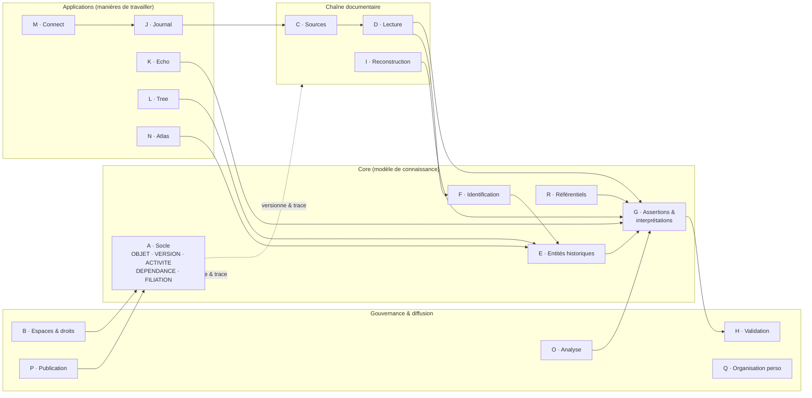

---

# 3. Domaine A — Socle transversal

Le socle porte les mécanismes que le CDCF exige pour **tous** les objets de connaissance : identité persistante, versions, provenance, dépendances, filiation entre espaces, citabilité.

## 3.1 Le super-type OBJET

`OBJET` est une entité abstraite. Toute entité marquée **Obj. ✓** dans les dictionnaires en est une spécialisation (héritage exclusif) : elle hérite de son identifiant persistant, de son espace, de ses versions, de ses droits, de ses dépendances, de ses étiquettes et de ses évaluations. Les associations génériques ci-dessous s'écrivent donc une seule fois.

Ne sont **pas** des `OBJET` : les comptes (`UTILISATEUR`), la journalisation (`ACTIVITE`, `VERSION_OBJET`), les fichiers binaires, les notifications, l'historique de navigation et les associations techniques.

## 3.2 Diagramme

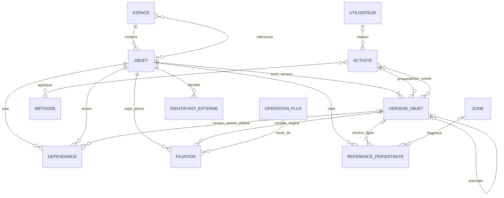

## 3.3 Entités

| Entité | Obj. | Définition | Propriétés |
|---|---|---|---|
| OBJET | — | Super-type abstrait de tout objet de connaissance ou de travail identifiable, versionnable, citable et soumis à des droits. | `#id_objet`, uri_persistante, type_objet, date_creation (temps épistémique), etat_cycle_vie ⟨D-01⟩, etat_examen ⟨D-02⟩, statut_validation ⟨D-03⟩ (dérivé du dernier `ACTE_EVALUATION`), visibilite ⟨D-04⟩, decouvrabilite ⟨D-05⟩, libelle_technique |
| VERSION_OBJET | — | État figé d'un objet à un moment épistémique. Jamais modifiée, jamais supprimée hors obligation légale. | `#id_version`, numero, date_debut_validite, date_fin_validite, etat_fige (contenu sérialisé de l'objet), nature_changement {création, correction technique, changement scientifique, changement de statut, changement de gouvernance, restriction}, motif |
| ACTIVITE | — | Acte de production ou de transformation (humain, assisté ou automatique). Porte la provenance « qui, quand, comment, avec quel moteur ». | `#id_activite`, type_activite ⟨D-06⟩, date_debut, date_fin, mode {manuel, assisté, automatique}, declenchement {explicite, planifié, automatique léger}, moteur, version_moteur, parametres_decisifs, ia_generative (booléen), intervention_humaine {aucune, examen, correction, validation}, mode_lecture {assistée, indépendante/aveugle, sans objet} |
| DEPENDANCE | — | Association porteuse : un objet aval dépend d'un objet amont. Fonde la propagation des corrections. | `#id_dependance`, type_dependance ⟨D-07⟩, role_probatoire ⟨D-08⟩, etat_impact {inchangé, potentiellement affecté, à réexaminer, invalidé, à recalculer}, date_signalement |
| FILIATION | — | Association porteuse : un objet dérive d'une version d'un autre objet, généralement dans un autre espace (contribution, import, restauration). | `#id_filiation`, type_filiation {contribution, import, échange Tree↔Tree, restauration, réutilisation}, etat_divergence {alignés, divergents, mise à jour proposée, mise à jour importée, divergence assumée}, date_constat |
| REFERENCE_PERSISTANTE | ✓ | Lien profond durable vers un objet, éventuellement figé sur une version et un fragment. | `#id_reference`, identifiant (persistant, résoluble), mode {courant, figé}, fragment (ligne, minute, coordonnées) |
| IDENTIFIANT_EXTERNE | — | Identifiant ou lien d'un objet dans un système tiers. | `#id_identifiant_externe`, systeme, valeur, type {identifiant officiel, lien externe déclaré, correspondance candidate}, statut {actif, obsolète, contesté}, date_constat |

## 3.4 Associations

| Association | Pattes | Propriétés portées |
|---|---|---|
| CONTENIR (lieu de production) | ESPACE (0,n) — OBJET (1,1) | — |
| REFERENCER (contexte d'utilisation) | ESPACE (0,n) — OBJET (0,n) | date, motif |
| AVOIR_VERSION | OBJET (1,n) — VERSION_OBJET (1,1) | — |
| PRECEDER | VERSION_OBJET (0,1) — VERSION_OBJET (0,1) | — |
| PRODUIRE | ACTIVITE (0,n) — VERSION_OBJET (1,1) | — |
| UTILISER_ENTREE | ACTIVITE (0,n) — VERSION_OBJET (0,n) | rôle de l'entrée |
| REALISER | UTILISATEUR (0,n) — ACTIVITE (0,1) | — |
| APPLIQUER | ACTIVITE (0,n) — METHODE (0,n) | version de méthode |
| DEPENDRE (aval) | OBJET (0,n) — DEPENDANCE (1,1) | — |
| DEPENDRE (amont) | OBJET (0,n) — DEPENDANCE (1,1) | — |
| UTILISER_VERSION | VERSION_OBJET (0,n) — DEPENDANCE (0,1) | — |
| DERIVER (objet dérivé) | OBJET (0,n) — FILIATION (1,1) | — |
| DERIVER (origine) | VERSION_OBJET (0,n) — FILIATION (1,1) | — |
| RESULTER | OPERATION_FLUX (0,n) — FILIATION (0,1) | — |
| VISER | OBJET (0,n) — REFERENCE_PERSISTANTE (1,1) | — |
| FIGER_SUR | VERSION_OBJET (0,n) — REFERENCE_PERSISTANTE (0,1) | — |
| POINTER_FRAGMENT | ZONE (0,n) — REFERENCE_PERSISTANTE (0,1) | — |
| IDENTIFIER_EXT | OBJET (0,n) — IDENTIFIANT_EXTERNE (1,1) | — |

## 3.5 Règles de gestion

- **RG-A01** — Toute création ou modification d'un `OBJET` crée une `VERSION_OBJET` produite par une `ACTIVITE`. Aucune mise à jour en place. (§ 1.3 eng. 2, § 55)
- **RG-A02** — Un `OBJET` appartient à exactement un `ESPACE` (son lieu de production) et peut être référencé par d'autres espaces du même régime sans duplication. (§ 4.5, Q224)
- **RG-A03** — Le passage d'un objet vers un espace de régime différent (privé → Core partagé) ne déplace pas l'objet : il crée un nouvel objet dans l'espace cible et une `FILIATION` vers la version d'origine. Aucune synchronisation n'est déduite de la filiation. (§ 4.3, § 4.4)
- **RG-A04** — Quand une nouvelle version d'un objet amont est créée, toutes les `DEPENDANCE` qui le citent passent à `potentiellement affecté` (sauf si le changement est `correction technique` sans incidence). L'objet aval n'est pas modifié. (§ 5.4, § 25.14, § 41.3)
- **RG-A05** — Une `REFERENCE_PERSISTANTE` en mode `figé` désigne obligatoirement une `VERSION_OBJET` ; en mode `courant` elle n'en désigne aucune. Les droits s'appliquent à la résolution. (§ 40, § 87)
- **RG-A06** — `ACTIVITE.ia_generative = vrai` impose `moteur` et `version_moteur` renseignés, et `etat_examen = automatique` sur les versions produites tant qu'aucune activité humaine d'examen ne suit. Le temps ne fait jamais passer un objet à `validé`. (§ 93.3, § 94)
- **RG-A07** — Un `IDENTIFIANT_EXTERNE` de type `correspondance candidate` n'établit pas d'identité. (§ 86)

## 3.6 Consolidation canonique — circulation inter-espace et dépendances

### Entités / associations ajoutées

| Objet | Nature | Définition | Propriétés conceptuelles |
|---|---|---|---|
| REFERENCE_INTER_ESPACE | association porteuse | Un espace utilise un objet/une identité gouverné dans un autre espace **sans copie** et sans transfert de connaissance. | date, motif, état courant |
| ETAT_REFERENCE_EXTERNE | historique | État temporel d'une référence externe. | {active, cible révisée, redirigée, retirée, inaccessible, non résolue}, date, motif |
| DEPENDANCE_PRODUCTION | spécialisation de dépendance | Décrit ce qui a effectivement servi à produire un objet ou une conclusion. | rôle, version amont |
| DEPENDANCE_JUSTIFICATION | spécialisation de dépendance | Décrit ce qui justifie actuellement une assertion, interprétation ou conclusion. | rôle probatoire, version amont |
| DEPENDANCE_RAISONNEMENT | spécialisation de dépendance | Arête du graphe logique permettant notamment la détection de cycles. | sens, nature |
| BASE_JUSTIFICATIVE | ✓ | Ensemble versionné des éléments actuellement invoqués pour justifier une production scientifique. | portée, date, statut |
| ACQUISITION_INFORMATION | ✓ | Entrée d'une information dans GENIIUS par import, saisie, transmission ou réutilisation. | mode, date, fournisseur, lot, transformation |
| ACQUISITION_DOCUMENTAIRE | ✓ | Acquisition d'un document/reproduction/fichier, distincte de son origine historique. | mode, date, détenteur/fournisseur, conditions |

### Règles canoniques

- **RG-A08** — `REFERENCER` ne crée ni copie, ni filiation, ni synchronisation.
- **RG-A09** — `FILIATION` crée un état/objet autonome pouvant diverger.
- **RG-A10** — Une hypothèse selon laquelle deux identités individualisées désignent le même objet historique relève du domaine F (`RAPPROCHEMENT` / correspondance identitaire), jamais de `REFERENCE_INTER_ESPACE`.
- **RG-A11** — Une scission, fusion, redirection ou indisponibilité de la cible ne réécrit jamais silencieusement l'espace référent ; elle modifie l'état de référence et peut déclencher un réexamen.
- **RG-A12** — Une dépendance de production n'est pas automatiquement une dépendance de justification.
- **RG-A13** — Les cycles du graphe de raisonnement sont autorisés comme objets d'étude mais ne peuvent pas être comptés comme justifications indépendantes.
- **RG-A14** — Une acquisition décrit comment l'information est entrée dans GENIIUS ; elle ne constitue pas en elle-même une preuve historique.

---

# 4. Domaine B — Espaces, comptes, droits, gouvernance

## 4.1 Diagramme

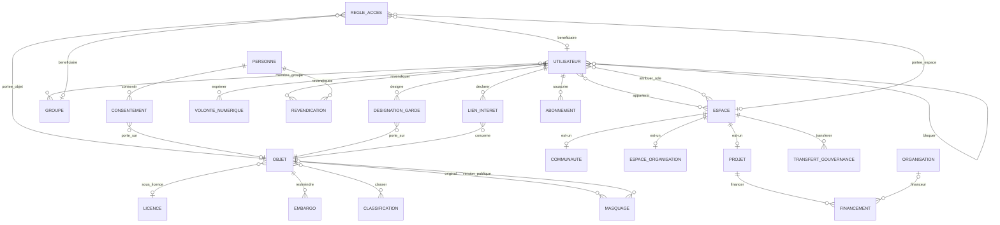

## 4.2 Entités

| Entité | Obj. | Définition | Propriétés |
|---|---|---|---|
| UTILISATEUR | — | Compte. Distinct de toute `PERSONNE` historique (§ 67). | `#id_utilisateur`, identite_civile (interne), email, niveau_verification_identite {aucun, standard, renforcé}, mode_affichage_public {nom réel, pseudonyme stable, masqué}, pseudonyme, categories_sollicitation_acceptees, date_inscription, etat_compte |
| ESPACE | ✓ | Régime de gouvernance dans lequel vivent des objets. Le Core partagé et la publication publique sont des espaces. | type_espace ⟨D-09⟩, nom, regime_gouvernance, date_creation |
| PROJET | ✓ | ⊂ ESPACE. Projet de recherche ou de mémoire (cf. domaine K). | voir § 13 |
| COMMUNAUTE | ✓ | ⊂ ESPACE. Espace de coopération autour d'un objet historique, documentaire ou méthodologique (§ 57). | objet_focal (texte), charte |
| ESPACE_ORGANISATION | ✓ | ⊂ ESPACE. Structure adhérente : association, laboratoire, service d'archives, collectivité, entreprise, cabinet (§ 65). | nature_structure, forme_juridique |
| GROUPE | ✓ | Ensemble nommé d'utilisateurs : famille, cercle invité, équipe. Sert aux droits **et** à l'indépendance des validateurs. | nom, type_groupe {famille, cercle invité, équipe, autre} |
| REGLE_ACCES | ✓ | Permission granulaire : qui peut faire quoi, sur quelle portée, pour combien de temps (§ 62). | action ⟨D-10⟩, type_beneficiaire {utilisateur, groupe, rôle d'espace, public}, date_debut, date_fin, condition, sensibilite |
| LICENCE | — | Référentiel de licences, appliquées **par composant** (§ 80). | `#code_licence`, libelle, redistribution, modification, usage_commercial, attribution_requise |
| EMBARGO | ✓ | Restriction temporaire ou conditionnelle. | portee {média, transcription, information, usage, existence même}, date_fin, condition_levee, motif, statut {actif, levé, expiré} |
| CLASSIFICATION | — | Référentiel des catégories de données (§ 96) qui alimente droits, export, IA, partage. | `#code_classification`, libelle |
| MASQUAGE | ✓ | Transformation de protection d'un objet (§ 70). | type {masquage, pseudonymisation, anonymisation}, pseudonyme_attribue, perimetre, date |
| CONSENTEMENT | ✓ | Consentement explicite, versionné, horodaté (§ 24.16, § 72). | portee {enregistrement, transcription, usage familial, usage projet, publication, usage posthume, biométrie}, decision {accordé, refusé, retiré}, texte_version, horodatage, mode_recueil |
| VOLONTE_NUMERIQUE | ✓ | Volonté d'un utilisateur sur ses contenus, par catégorie ou projet (§ 72). | action {conserver, transmettre, publier, remettre, supprimer, transmettre les enregistrements}, perimetre, beneficiaire, condition_declenchement |
| REVENDICATION | ✓ | Lien vérifié « je suis cette personne » entre un compte et une `PERSONNE` (§ 67). | niveau_verification, date, statut {déclarée, vérifiée, révoquée} |
| TRANSFERT_GOUVERNANCE | ✓ | Transfert historisé de la gouvernance d'un espace (§ 65.1). | date, perimetre, exclusions, conditions, autorisation |
| DESIGNATION_GARDE | ✓ | Désignation d'un rôle de garde ou de succession sur un objet ou un espace (§ 24.15, § 25.18, § 89). | role ⟨D-11⟩, condition_effet {immédiat, décès, date, autre}, date_effet, statut {prévue, effective, révoquée} |
| LIEN_INTERET | ✓ | Lien déclaré entre un utilisateur et ce qu'il évalue (§ 55.1). | type {valide sa propre famille, propriétaire du fonds, membre du projet évalué, participant à l'événement, financeur, autre}, date_declaration |
| FINANCEMENT | ✓ | Source de financement d'un projet, comme provenance (§ 55, Q213). | type {autofinancement, association, université, collectivité, subvention, mécénat, crowdfunding}, montant (`VALEUR`), periode, obligations |
| ABONNEMENT | — | Droit d'usage acheté (stockage, calcul, quotas). | `#id_abonnement`, offre, quotas, credits_calcul, date_debut, date_fin |

## 4.3 Associations

| Association | Pattes | Propriétés portées |
|---|---|---|
| APPARTENIR | UTILISATEUR (0,n) — ESPACE (0,n) | role_espace {propriétaire, administrateur, responsable scientifique, collaborateur, invité, lecteur}, date_debut, date_fin |
| ATTRIBUER_ROLE | UTILISATEUR (0,n) — ESPACE (0,n) | role_gouvernance {contributeur, validateur, référent communautaire, modérateur, administrateur technique}, procedure, date, domaine (→ `DOMAINE_EXPERTISE`) |
| MEMBRE_GROUPE | UTILISATEUR (0,n) — GROUPE (0,n) | date_debut, date_fin |
| PORTER_SUR_OBJET / PORTER_SUR_ESPACE | REGLE_ACCES (1,1) — OBJET (0,n) **ou** ESPACE (0,n) | — |
| BENEFICIER | REGLE_ACCES (1,1) — UTILISATEUR (0,n) **ou** GROUPE (0,n) ; aucun si `public` | — |
| SOUS_LICENCE | OBJET (0,1) — LICENCE (0,n) | — |
| RESTREINDRE | OBJET (0,n) — EMBARGO (1,1) | — |
| CLASSER | OBJET (0,n) — CLASSIFICATION (0,n) | origine {déclarée, déduite} |
| MASQUER | OBJET (0,n) — MASQUAGE (1,1) (original) ; OBJET (0,1) — MASQUAGE (0,1) (version publique) | — |
| CONSENTIR | PERSONNE (0,n) — CONSENTEMENT (1,1) ; CONSENTEMENT (0,1) — OBJET (0,n) **ou** ESPACE (0,n) | — |
| EXPRIMER | UTILISATEUR (0,n) — VOLONTE_NUMERIQUE (1,1) | — |
| REVENDIQUER | UTILISATEUR (0,n) — REVENDICATION (1,1) — PERSONNE (0,n) | — |
| TRANSFERER | ESPACE (0,n) — TRANSFERT_GOUVERNANCE (1,1) ; cédant UTILISATEUR (0,n) — (1,1) ; cessionnaire UTILISATEUR (0,n) — (1,1) | — |
| DESIGNER | DESIGNATION_GARDE (1,1) — OBJET (0,n) ; désigné UTILISATEUR (0,n) — (0,1) **ou** PERSONNE (0,n) — (0,1) (destinataire futur) | — |
| DECLARER_INTERET | UTILISATEUR (0,n) — LIEN_INTERET (1,1) — OBJET (0,n) | — |
| FINANCER | PROJET (0,n) — FINANCEMENT (1,1) ; FINANCEMENT (0,1) — ORGANISATION (0,n) | — |
| SOUSCRIRE | UTILISATEUR (0,n) **ou** ESPACE (0,n) — ABONNEMENT (1,1) | — |
| BLOQUER | UTILISATEUR (0,n) — UTILISATEUR (0,n) | date |

## 4.4 Règles de gestion

- **RG-B01** — Aucun objet ne change d'espace par simple modification de visibilité vers le Core partagé : seule une `OPERATION_FLUX` de type `contribution`, réalisée par un utilisateur autorisé, peut créer un objet dans le Core partagé. (§ 1.3 eng. 4, § 56, critère 8)
- **RG-B02** — Visibilité, découvrabilité et réutilisation (licence) sont trois propriétés indépendantes. (§ 61.2)
- **RG-B03** — Un `TRANSFERT_GOUVERNANCE` ou une `DESIGNATION_GARDE` ne lève aucun `EMBARGO`, ne modifie aucun `CREDIT` et ne confère pas de droits que le cédant ne possédait pas. (§ 65.1, § 89)
- **RG-B04** — Une `REVENDICATION` vérifiée ne donne aucun droit d'édition sur la `PERSONNE` : elle ouvre seulement témoignage, consentement, signalement, volontés. (§ 67)
- **RG-B05** — `ABONNEMENT` n'a aucune association avec `ACTE_EVALUATION`, `BADGE`, `ATTRIBUER_ROLE` ni avec le poids d'un vote. (§ 35, § 100)
- **RG-B06** — Un `CONSENTEMENT` retiré produit une nouvelle version (statut `retiré`) ; l'ancien consentement reste historisé. (§ 72)
- **RG-B07** — Un `MASQUAGE` de type `anonymisation` n'est autorisé que si la version publique ne reste reliée à l'original par aucun chemin accessible publiquement ; sinon c'est une pseudonymisation. (§ 70)

## 4.5 Consolidation canonique — compte, acteur, personne et droits contextuels

### Séparation des identités

`UTILISATEUR` du MCD IO est désormais interprété comme **COMPTE** d'authentification.

| Entité | Obj. | Définition | Propriétés conceptuelles |
|---|---|---|---|
| COMPTE | — | Identité technique d'authentification et d'accès. | identifiants techniques, état, dates |
| ACTEUR_GENIIUS | ✓ | Identité contributive/scientifique durable : chercheur, transcripteur, validateur, déposant, organisation représentée. | nom/pseudonyme d'attribution, statut, période d'activité |
| LIEN_COMPTE_ACTEUR | — | Association temporelle entre un compte et un acteur. | date_debut, date_fin, niveau_verification |
| LIEN_COMPTE_PERSONNE | ✓ | Lien vérifié et révocable entre un compte et une `PERSONNE` ; ne confère pas la propriété de la vérité sur cette personne. | méthode, date, statut, niveau |
| DECISION_APPLICABILITE_DROIT | ✓ | Décide si une restriction amont reste applicable à un dérivé. | {applicable, partiellement applicable, non applicable, indéterminée, à réexaminer}, fondement, date |
| CONTEXTE_EVALUATION | — | Contexte d'une décision d'accès/diffusion/opération. | acteur, audience, espace, projet, rôle, instant, opération, finalité, canal |
| EVALUATION_DIFFUSABILITE | ✓ | Décision sur la possibilité de diffuser un résultat dans un contexte, après détermination des contraintes applicables. | décision, motif, risque_inference, date |

### Règles canoniques

- **RG-B08** — La suppression d'un `COMPTE` n'efface pas l'identité scientifique de l'`ACTEUR_GENIIUS` lorsque la conservation de l'attribution est légitime.
- **RG-B09** — Un acteur peut être lié à zéro, un ou plusieurs comptes successifs.
- **RG-B10** — Un `LIEN_COMPTE_PERSONNE` vérifié n'accorde pas le contrôle sur les assertions produites indépendamment à propos de cette personne.
- **RG-B11** — Une règle d'accès peut protéger le contenu **ou l'existence même** d'un objet, d'une relation, d'une dépendance ou d'une correspondance.
- **RG-B12** — Les arêtes scientifiques du graphe sont gouvernables au même titre que les nœuds.
- **RG-B13** — `DECISION_APPLICABILITE_DROIT` et `EVALUATION_DIFFUSABILITE` sont distinctes : la première détermine quelles contraintes subsistent ; la seconde décide ce qui peut être diffusé dans le contexte.
- **RG-B14** — Le risque d'inférence ou de ré-identification peut rendre un agrégat non diffusable même si les données brutes ne sont pas exposées.

---

# 5. Domaine C — Sources et hiérarchie documentaire

Le CDCF distingue quatre niveaux : **unité intellectuelle** (`DOCUMENT`), **exemplaire matériel** (`EXEMPLAIRE`), **reproduction** (`REPRODUCTION`) et **fragment effectivement consulté** (porté par `RECHERCHE_EFFECTUEE`, domaine K). Les cotes et l'ordre de classement sont historisés séparément de l'identité du document (§ 15).

## 5.1 Diagramme

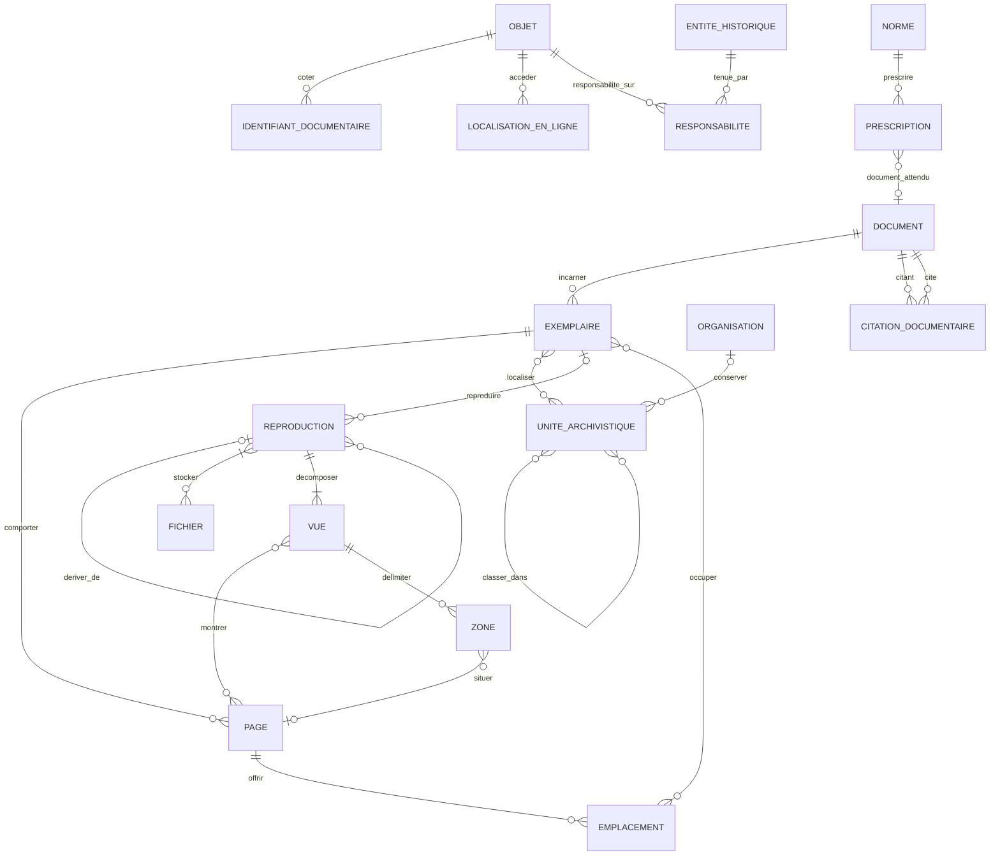

## 5.2 Entités

| Entité | Obj. | Définition | Propriétés |
|---|---|---|---|
| DOCUMENT | ✓ | Unité intellectuelle : un acte, un registre, une photographie, un enregistrement, un témoignage. Existe même s'il est perdu ou seulement prescrit. | titre_forge, nature ⟨D-12⟩, type_documentaire (→ `CONCEPT`), date_production (`DATE_HIST`), langues, statut_existence ⟨D-13⟩, accessibilite {accessible, restreint, inaccessible, inconnue}, description, etat_provenance ⟨D-14⟩ |
| EXEMPLAIRE | ✓ | Support matériel d'un document : original, minute, expédition, double de greffe, tirage photo, album. | type_exemplaire {original, minute, expédition, copie authentique, duplicata, copie privée, tirage, album, autre}, description_materielle, etat_conservation, nb_pages_declare |
| UNITE_ARCHIVISTIQUE | ✓ | Niveau de description archivistique (fonds, série, sous-série, article, registre, dossier, pièce). Granularité progressive. | niveau {fonds, série, sous-série, article/cote, registre, dossier, pièce}, intitule, dates_extremes (`DATE_HIST`), description |
| IDENTIFIANT_DOCUMENTAIRE | ✓ | Cote ou identifiant successif, historisé (« cote ≠ identité »). | valeur, type {cote actuelle, ancienne cote, identifiant historique, numéro d'acte, ARK, autre}, institution_emettrice, date_debut, date_fin |
| LOCALISATION_EN_LIGNE | ✓ | Adresse d'accès en ligne historisée, avec état d'accès observé (§ 98). | adresse, type {URL, ARK, DOI, manifeste IIIF, autre}, plateforme, date_debut, date_fin, etat_acces ⟨D-15⟩, date_observation |
| PAGE | ✓ | Face physique d'un exemplaire (folio, recto/verso, page d'album). | numero, folio, face {recto, verso, sans objet}, rang, etat {présente, absente, endommagée} |
| REPRODUCTION | ✓ | Reproduction d'un exemplaire ou transformation d'une autre reproduction ; maillon de la lignée de reproduction (§ 18). | type ⟨D-16⟩, date, qualite, pages_manquantes, support, produite_par_ia, original_recuperable |
| FICHIER | — | Fichier binaire. Son empreinte permet la déduplication **technique**. | `#id_fichier`, empreinte, format, taille, emplacement_stockage, date_depot |
| VUE | ✓ | Image ou piste d'une reproduction. | rang, type {image, piste audio, piste vidéo}, duree |
| ZONE | ✓ | Fragment localisé d'une vue : région d'image, ligne, plage temporelle. Point d'ancrage universel de la preuve. | type_geometrie {rectangle, polygone, ligne, point, plage temporelle, vue entière}, geometrie (`GEOM` image), debut_ms, fin_ms, libelle |
| RESPONSABILITE | — | Association porteuse : rôle documentaire d'une entité historique sur un document, un exemplaire ou une assertion (§ 16). | `#id_responsabilite`, role ⟨D-17⟩, certitude ⟨D-19⟩ |
| CITATION_DOCUMENTAIRE | ✓ | Un document en présente, cite, annexe, résume ou reproduit un autre (§ 17). | type {présenté, cité, annexé, résumé, reproduit, copie de, probablement utilisé, concordant}, certitude ⟨D-19⟩ |
| EMPLACEMENT | ✓ | Emplacement (slot) d'une page d'album, vide ou occupé (§ 32.3). | position, etat {occupé, vide, trace de retrait}, type_ordre ⟨D-18⟩ |
| PRESCRIPTION | ✓ | Une norme prescrit la production d'un type de document sur un territoire et une période (§ 22). | periode (`DATE_HIST`), type_document_attendu (→ `CONCEPT`), territoire (→ `LIEU`) |

## 5.3 Associations

| Association | Pattes | Propriétés portées |
|---|---|---|
| INCARNER | DOCUMENT (0,n) — EXEMPLAIRE (1,1) | — |
| COMPORTER | EXEMPLAIRE (0,n) — PAGE (1,1) | — |
| LOCALISER | EXEMPLAIRE (0,n) — UNITE_ARCHIVISTIQUE (0,n) | type_ordre ⟨D-18⟩, rang, periode |
| CLASSER_DANS | UNITE_ARCHIVISTIQUE enfant (0,n) — UNITE_ARCHIVISTIQUE parent (0,n) | type_ordre ⟨D-18⟩, rang, periode |
| CONSERVER | UNITE_ARCHIVISTIQUE (0,1) — ORGANISATION (0,n) | (historisé par versions) |
| COTER | OBJET (`DOCUMENT`, `EXEMPLAIRE` ou `UNITE_ARCHIVISTIQUE`) (0,n) — IDENTIFIANT_DOCUMENTAIRE (1,1) | — |
| ACCEDER | OBJET (`DOCUMENT` ou `REPRODUCTION`) (0,n) — LOCALISATION_EN_LIGNE (1,1) | — |
| REPRODUIRE | EXEMPLAIRE (0,n) — REPRODUCTION (0,1) | — |
| DERIVER_DE | REPRODUCTION parente (0,n) — REPRODUCTION dérivée (0,1) | — |
| STOCKER | REPRODUCTION (1,n) — FICHIER (0,n) | rôle {master, dérivé, vignette} |
| DECOMPOSER | REPRODUCTION (1,n) — VUE (1,1) | — |
| MONTRER | VUE (0,n) — PAGE (0,n) | — |
| DELIMITER | VUE (0,n) — ZONE (1,1) | — |
| SITUER | ZONE (0,1) — PAGE (0,n) | — |
| RESPONSABILITE_SUR | OBJET (0,n) — RESPONSABILITE (1,1) | — |
| TENUE_PAR | ENTITE_HISTORIQUE (0,n) — RESPONSABILITE (1,1) | — |
| CITER_DOC | DOCUMENT citant (0,n) — CITATION_DOCUMENTAIRE (1,1) ; DOCUMENT cité (0,n) — (1,1) ; CITATION_DOCUMENTAIRE (0,n) — ZONE (0,n) (ancrage) | — |
| OFFRIR | PAGE (0,n) — EMPLACEMENT (1,1) | — |
| OCCUPER | EMPLACEMENT (0,n) — EXEMPLAIRE (photo) (0,n) | periode, type_ordre |
| PRESCRIRE | NORME (0,n) — PRESCRIPTION (1,1) ; PRESCRIPTION (0,1) — DOCUMENT (0,n) | — |

## 5.4 Règles de gestion

- **RG-C01** — Une `REPRODUCTION` a exactement une origine : soit un `EXEMPLAIRE` (REPRODUIRE), soit une autre `REPRODUCTION` (DERIVER_DE). La lignée est donc toujours remontable jusqu'à l'exemplaire. (§ 18.2)
- **RG-C02** — Une `REPRODUCTION` de type colorisation, generative fill ou amélioration n'est jamais acceptée comme ancrage probatoire des couleurs ou détails qu'elle a produits ; l'original reste récupérable. (§ 18.3)
- **RG-C03** — Plusieurs reproductions ayant le même exemplaire pour ancêtre ne comptent pas comme des preuves indépendantes. (§ 18.2, § 112)
- **RG-C04** — Un `DOCUMENT` peut exister sans `EXEMPLAIRE` (perdu, détruit, prescrit, connu par citation). (§ 20.1)
- **RG-C05** — `statut_existence = prescrit seulement` ne peut pas être déduit en `existence attestée` sans une assertion appuyée sur une trace. (§ 22, critère 33)
- **RG-C06** — Un changement de cote crée un nouvel `IDENTIFIANT_DOCUMENTAIRE` et clôt l'ancien ; l'identité du document est inchangée. Une URL morte ne supprime ni le document ni sa provenance. (§ 15.3, § 98)
- **RG-C07** — Deux `FICHIER` de même empreinte sont un doublon technique et peuvent être fusionnés ; cette règle ne s'applique jamais aux entités historiques. (§ 7, Q196)

## 5.5 Consolidation canonique — ressource numérique et composition

- `FICHIER` demeure une ressource binaire technique : une empreinte identique ne prouve jamais une identité documentaire.
- Une même ressource binaire peut participer à plusieurs occurrences documentaires sans fusionner leurs contextes.
- La composition documentaire est réifiée lorsque nécessaire : album → photographies, dossier → pièces, registre → cahiers/pages, document contenant un document.
- L'ordre physique, l'ordre archivistique, la pagination/foliotation historique et l'index numérique peuvent coexister.
- Une annotation postérieure (tampon, restauration, note, rature) possède son propre temps et sa propre responsabilité documentaire.
- Une nouvelle numérisation ne réutilise pas automatiquement les coordonnées d'ancrage d'une ancienne reproduction ; un alignement explicite est requis.

### SOURCE_EXTERNE_DECLAREE

Une référence de source importée peut être : `non résolue`, `déclarée`, `rapprochée`, `identifiée`.

Une chaîne importée telle que « archives familiales » ne crée pas automatiquement un `DOCUMENT` identifié.

---

# 6. Domaine D — Lecture : transcription, annotation, mention, traces

## 6.1 Diagramme

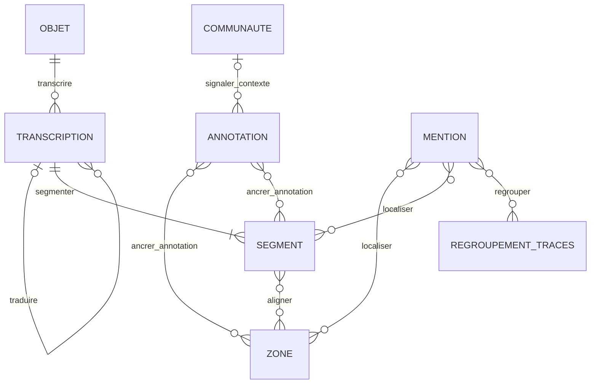

## 6.2 Entités

| Entité | Obj. | Définition | Propriétés |
|---|---|---|---|
| TRANSCRIPTION | ✓ | Une couche textuelle d'un document ou exemplaire, par un auteur, dans un mode de lecture. Plusieurs couches et plusieurs lectures concurrentes coexistent (§ 23.2, Q148). | couche ⟨D-20⟩, langue, ecriture (script), mode_lecture {assistée, indépendante/aveugle}, statut {en cours, achevée selon protocole, abandonnée} |
| SEGMENT | ✓ | Unité de texte d'une transcription (ligne, mot, paragraphe, marge), alignée sur des zones. Le désaccord de lecture se localise ici. | rang, texte, type {mot, ligne, paragraphe, marge, interligne}, incertitude_lecture {certaine, probable, douteuse, illisible} |
| ANNOTATION | ✓ | Observation localisée, sans transcription nécessaire : signature, tampon, rature, main, dommage, note de contexte, appareil critique (§ 23.3, § 19.2). | type ⟨D-21⟩, contenu, visible_publiquement |
| MENTION | ✓ | Occurrence de quelque chose dans une source : nom, désignation, visage, voix, signature. N'est pas une entité (§ 5). | texte_exact, nature ⟨D-22⟩, categorie_pressentie {personne, lieu, organisation, objet, bien, événement, collectif, date, montant, autre}, statut_resolution ⟨D-23⟩ |
| REGROUPEMENT_TRACES | ✓ | Groupe de mentions attribuées à un même porteur non identifié : individu visuel P-184, cluster vocal, main H-17 (§ 33). | type {individu visuel, cluster vocal, main d'écriture, signature récurrente}, code, statut {proposé, examiné, contesté} |

## 6.3 Associations

| Association | Pattes | Propriétés portées |
|---|---|---|
| TRANSCRIRE | OBJET (`DOCUMENT` ou `EXEMPLAIRE`) (0,n) — TRANSCRIPTION (1,1) | — |
| TRADUIRE | TRANSCRIPTION source (0,n) — TRANSCRIPTION traduction (0,1) | — |
| SEGMENTER | TRANSCRIPTION (1,n) — SEGMENT (1,1) | — |
| ALIGNER | SEGMENT (0,n) — ZONE (0,n) | — |
| ANCRER_ANNOTATION | ANNOTATION (1,n) — ZONE (0,n) / SEGMENT (0,n) | — |
| SIGNALER_CONTEXTE | COMMUNAUTE (0,n) — ANNOTATION (0,1) | — |
| LOCALISER_MENTION | MENTION (1,n) — ZONE (0,n) / SEGMENT (0,n) | role_probatoire ⟨D-08⟩ |
| REGROUPER | MENTION (0,n) — REGROUPEMENT_TRACES (0,n) | degre {proposé, probable, examiné} |

## 6.4 Règles de gestion

- **RG-D01** — Une correction de lecture crée une nouvelle version du `SEGMENT` ; ni l'image, ni la zone, ni les autres lectures ne sont modifiées. (§ 5.3, critère 2)
- **RG-D02** — Une transcription réalisée en mode `indépendante/aveugle` ne donne accès à aucune autre lecture de la même zone avant d'être enregistrée ; la comparaison intervient après. (§ 17, § 23.6)
- **RG-D03** — Aucune source ne corrige la lecture d'une autre source : une forme CHARBONNIER dans B ne modifie aucun `SEGMENT` de A. (§ 7.2)
- **RG-D04** — Le texte d'un segment n'est jamais censuré ; un terme offensant est contextualisé par une `ANNOTATION` de type `note de contexte` ou `avertissement`. (§ 19, § 60)
- **RG-D05** — Une `MENTION` peut rester indéfiniment `non traitée` ou `non individualisable` ; elle ne crée jamais automatiquement de `PERSONNE`. (§ 5, § 6.2)
- **RG-D06** — Un `REGROUPEMENT_TRACES` ne vaut pas identification : il devient une identité seulement via une `PROPOSITION_IDENTIFICATION` examinée. (§ 33.1, § 33.2)
- **RG-D07** — L'exploitation d'une source est une `APPLICATION_PROTOCOLE` (domaine K) sur le document : « exhaustif » n'existe que relativement à un protocole. (§ 16, § 23.5)

## 6.5 Consolidation canonique — dérivation des unités d'information

La chaîne :

`audio/image → zone/segment → transcription → réponse/mention → assertion → extrait publié`

est représentable comme une suite de dérivations dont chaque unité conserve :

- sa provenance ;
- sa version ;
- ses droits ;
- sa dépendance à l'amont.

Une traduction est une **expression dérivée**. Elle ne crée une nouvelle assertion scientifique que si le sens propositionnel change.

---

# 7. Domaine E — Entités historiques

## 7.1 Diagramme

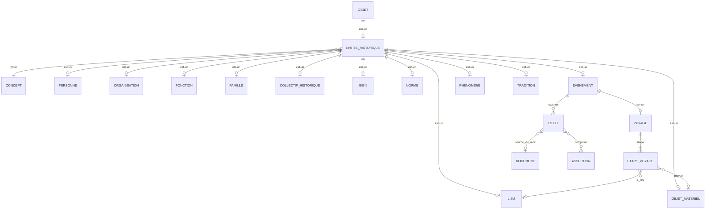

## 7.2 Entités

| Entité | Obj. | Définition | Propriétés |
|---|---|---|---|
| ENTITE_HISTORIQUE | ✓ | Super-type abstrait de ce qui existe dans le monde historique. Porte **l'identité**, jamais les faits. | libelle_travail (technique, non historique), note_individualisation, densite_documentaire (calculée ; jamais un poids d'importance) |
| PERSONNE | ✓ | ⊂ ENTITE_HISTORIQUE. Être humain individualisé par un chercheur, même sans nom (§ 5 cas A, § 6). Une personne réduite en esclavage reste une `PERSONNE` (§ 6.5). | mode_individualisation {nommée, prénom seul, surnom/désignation, anonyme individualisée}, regime_protection {vivant attesté, raisonnablement présumé vivant, décédé attesté, statut vital inconnu}, mineur_protege, date_reevaluation_protection |
| LIEU | ✓ | ⊂ ENTITE_HISTORIQUE. Lieu historique, même disparu ou sans coordonnées (§ 27). | couche_spatiale ⟨D-24⟩, existence_actuelle {existe, disparu, inconnu} |
| ORGANISATION | ✓ | ⊂ ENTITE_HISTORIQUE. Mairie, paroisse, tribunal, étude notariale, service d'archives, habitation-exploitation, unité militaire… (§ 29.1). | nature (via `CONCEPT`) |
| FONCTION | ✓ | ⊂ ENTITE_HISTORIQUE. Poste ou fonction, distinct de l'organisation et de son titulaire (§ 29.3). | intitule_generique |
| FAMILLE | ✓ | ⊂ ENTITE_HISTORIQUE. Groupe de parenté, distinct du foyer et du logement (§ 13.3). | critere_definition |
| COLLECTIF_HISTORIQUE | ✓ | ⊂ ENTITE_HISTORIQUE. Collectif attesté : convoi, foyer observé, équipage, atelier, population d'une habitation. Composition éventuellement partielle (§ 13.1). | nature {convoi, foyer, équipage, groupe de travailleurs, association, population, autre}, effectif_declare (`VALEUR`), date_observation (`DATE_HIST`, pour un foyer), composition_connue {complète, partielle, inconnue} |
| OBJET_MATERIEL | ✓ | ⊂ ENTITE_HISTORIQUE. Objet individualisé quand c'est historiquement utile ; navire = type `Objet > Moyen de transport > Navire` (§ 30). | nature (via `CONCEPT`) |
| BIEN | ✓ | ⊂ ENTITE_HISTORIQUE. Bien ou actif, séparé du lieu (§ 27.6, § 30.1). | nature {terre, maison, parcelle, rente, fonds, autre} |
| NORME | ✓ | ⊂ ENTITE_HISTORIQUE. Loi, décret, règlement, décision, quand c'est utile (§ 22). | nature {loi, décret, règlement, arrêté, décision, autre} |
| EVENEMENT | ✓ | ⊂ ENTITE_HISTORIQUE. Occurrence identifiable, y compris décisions, autorisations et non-événements (§ 10.1, § 36, § 37). | nature (via `CONCEPT`), mode_realite ⟨D-25⟩ |
| VOYAGE | ✓ | ⊂ EVENEMENT. Déplacement structuré en étapes (§ 28). | — |
| ETAPE_VOYAGE | ✓ | Étape d'un voyage, avec sa propre preuve. | rang, date (`DATE_HIST`), statut {attestée, reconstruite, hypothétique} |
| PHENOMENE | ✓ | ⊂ ENTITE_HISTORIQUE. Objet fédérateur : épidémie, cyclone, guerre, famine, grève, révolte, incendie (§ 27.10). | nature (via `CONCEPT`) |
| TRADITION | ✓ | ⊂ ENTITE_HISTORIQUE. Tradition ou légende familiale comme objet historique, avec ses variantes et sa transmission (§ 110). | origine_connue {connue, supposée, inconnue} |
| RECIT | ✓ | Version d'un événement selon un point de vue : accusé, témoin, tribunal, presse… La version judiciaire n'est pas la réalité (§ 35). | point_de_vue {accusé, victime, témoin, police, tribunal, presse, famille, chercheur, autre}, resume |

## 7.3 Associations

| Association | Pattes | Propriétés portées |
|---|---|---|
| TYPER | ENTITE_HISTORIQUE (1,1) — CONCEPT (0,n) | — |
| ETAPE | VOYAGE (1,n) — ETAPE_VOYAGE (1,1) | — |
| A_LIEU | ETAPE_VOYAGE (0,1) — LIEU (0,n) | — |
| MOYEN | ETAPE_VOYAGE (0,1) — OBJET_MATERIEL (0,n) | — |
| RACONTER | EVENEMENT (0,n) — RECIT (1,1) | — |
| SOURCE_DU_RECIT | RECIT (0,1) — DOCUMENT (0,n) | — |
| COMPOSER_RECIT | RECIT (0,n) — ASSERTION (0,n) | rang (séquence) |

## 7.4 Règles de gestion

- **RG-E01** — Aucun attribut d'une entité historique n'exprime un fait historique (naissance, sexe, profession, résidence, statut juridique, nom). Tous passent par `ASSERTION`. (Partie XVIII, § 49)
- **RG-E02** — Une `PERSONNE` n'exige ni nom, ni date, ni lieu, ni arbre, ni descendant. Elle peut n'être fondée que sur une seule mention. (§ 1.4, § 6.1, critères 5–7)
- **RG-E03** — Une classification historique de la personne comme bien, marchandise ou valeur est une `ASSERTION` attribuée à sa source ; aucune `PERSONNE` n'est jamais typée `BIEN` ni `OBJET_MATERIEL`. (§ 6.5, § 113)
- **RG-E04** — `regime_protection` est une règle de confidentialité, pas un fait : il ne crée aucune assertion de vie ou de décès. (§ 66)
- **RG-E05** — Un `EVENEMENT` de `mode_realite` `autorisation`, `projet` ou `intention` n'implique aucun `EVENEMENT` réalisé ; le lien décision → effet → réalisation est une `ASSERTION` de relation explicite. (§ 36, § 37, CU-24)
- **RG-E06** — Le type d'entité est un `CONCEPT` : une nouvelle catégorie (navire, prison, instrument) s'ajoute au référentiel sans modifier le modèle ni créer d'application. (§ 2.3, § 43, critère 22)
- **RG-E07** — Une `ETAPE_VOYAGE` reconstruite n'est jamais affichée comme attestée ; deux présences attestées ne créent pas de voyage. (§ 29, § 28, Q124)

---

# 8. Domaine F — Identification et identité

## 8.1 Diagramme

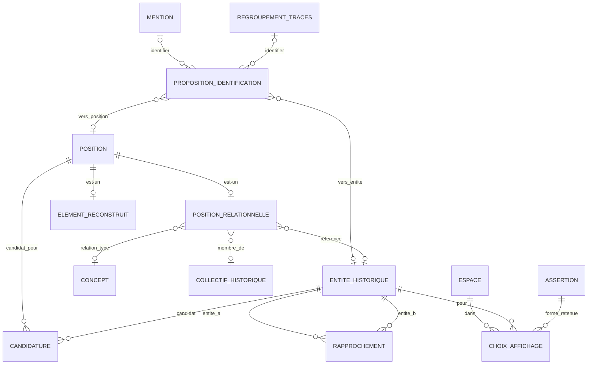

## 8.2 Entités

| Entité | Obj. | Définition | Propriétés |
|---|---|---|---|
| PROPOSITION_IDENTIFICATION | ✓ | Hypothèse « cette mention (ou ce regroupement) correspond à cette entité / à cette position ». Plusieurs propositions concurrentes pour une même mention = plusieurs candidats (§ 6, § 8.1, § 8.2). | plausibilite ⟨D-19⟩, verdict {même entité, entité distincte, indéterminé}, justification |
| POSITION | ✓ | Super-type d'une place humaine connue sans individu déterminé. | description, rang, statut {ouverte, résolue, déclarée inconnue} |
| POSITION_RELATIONNELLE | ✓ | ⊂ POSITION. « L'un des fils de Jean DUPONT », « l'une des trois sœurs », « un membre parmi 24 du convoi », position impliquée par un compte (§ 6.3, Q135). | nature {un parmi des candidats, membre non individualisé d'un collectif, position impliquée par un compte, position manquante}, effectif_implique |
| ELEMENT_RECONSTRUIT | ✓ | ⊂ POSITION. Élément d'un document perdu reconstruit (domaine I). | voir § 11 |
| CANDIDATURE | ✓ | Une entité candidate pour une position, avec sa plausibilité et son statut ; les candidats écartés restent (Q138). | plausibilite ⟨D-19⟩, statut {en lice, écartée provisoirement, rejetée, retenue}, motif |
| RAPPROCHEMENT | ✓ | Hypothèse d'identité **entre deux entités** : même personne, personnes distinctes, indéterminé. Porte la fusion logique réversible et le lien Tree → Core (§ 7, § 8.3, § 26.2). | verdict {même entité, entités distinctes, indéterminé}, presentation_fusionnee (booléen), portee {intra-espace, privé→Core partagé, Tree↔Tree, inter-espaces}, justification |
| CHOIX_AFFICHAGE | ✓ | Choix, dans un espace, de la forme de nom affichée pour une entité : convention UX, pas vérité (§ 7.3). | motif |

## 8.3 Associations

| Association | Pattes | Propriétés portées |
|---|---|---|
| IDENTIFIER | MENTION (0,n) **ou** REGROUPEMENT_TRACES (0,n) — PROPOSITION_IDENTIFICATION (0,1) | — |
| VERS_ENTITE | PROPOSITION_IDENTIFICATION (0,1) — ENTITE_HISTORIQUE (0,n) | — |
| VERS_POSITION | PROPOSITION_IDENTIFICATION (0,1) — POSITION (0,n) | — |
| REFERENCE | POSITION_RELATIONNELLE (0,1) — ENTITE_HISTORIQUE (0,n) | — |
| RELATION_TYPE | POSITION_RELATIONNELLE (0,1) — CONCEPT (0,n) | — |
| MEMBRE_DE | POSITION_RELATIONNELLE (0,1) — COLLECTIF_HISTORIQUE (0,n) | — |
| CANDIDAT_POUR | POSITION (0,n) — CANDIDATURE (1,1) | — |
| CANDIDAT | ENTITE_HISTORIQUE (0,n) — CANDIDATURE (1,1) | — |
| RAPPROCHER | ENTITE_HISTORIQUE A (0,n) — RAPPROCHEMENT (1,1) ; ENTITE_HISTORIQUE B (0,n) — RAPPROCHEMENT (1,1) | — |
| CHOISIR_AFFICHAGE | ESPACE (0,n) — CHOIX_AFFICHAGE (1,1) ; ENTITE_HISTORIQUE (0,n) — (1,1) ; ASSERTION (nom) (0,n) — (1,1) | — |

## 8.4 Règles de gestion

- **RG-F01** — Une `PROPOSITION_IDENTIFICATION` a exactement une source (mention ou regroupement) et exactement une cible (entité ou position).
- **RG-F02** — Une mention ambiguë entre plusieurs entités donne plusieurs propositions ; le système n'en choisit aucune. (§ 8.2)
- **RG-F03** — « L'un des fils de Jean » est une `POSITION_RELATIONNELLE` avec des `CANDIDATURE` : aucune `PERSONNE` « Inconnu DUPONT » n'est créée. (§ 5 cas B, CU-13)
- **RG-F04** — Un `RAPPROCHEMENT` de verdict `même entité` ne supprime aucun identifiant ; `presentation_fusionnee` n'agit que sur l'affichage et reste réversible par une nouvelle version. (§ 8.3, critère 4)
- **RG-F05** — Les verdicts `entités distinctes` (non-identité) sont historisés et opposables aux futures propositions. (Q137)
- **RG-F06** — Un nom rare, un score ou une similarité visuelle ou vocale ne suffit jamais à passer `plausibilite` à `forte` sans `ARGUMENT` explicite. (§ 6, § 33, § 50)
- **RG-F07** — Le lien d'un individu de Tree vers une entité du Core partagé est un `RAPPROCHEMENT` de portée `privé→Core partagé` : il ne met en relation ni les propriétaires des arbres, ni leurs données. (§ 26.2, CU-21)

## 8.5 Consolidation canonique — identité inter-espace et position épistémique

### Trois mécanismes à ne jamais confondre

1. `REFERENCE_INTER_ESPACE` : réutilisation certaine d'une identité déjà reconnue ;
2. `FILIATION` : création d'un objet/état autonome dérivé ;
3. `RAPPROCHEMENT` : hypothèse d'identité entre deux objets individualisés.

### POSITION_EPISTEMIQUE

Un projet, une communauté, une publication ou un espace peut adopter une position contextualisée sur une proposition :

- adoptée ;
- rejetée ;
- indéterminée ;
- contestée ;
- à réexaminer.

Cette position n'est ni une vérité globale ni une modification de la preuve.

### Sélection contextuelle

`CHOIX_AFFICHAGE` est généralisé en logique de `SELECTION_CONTEXTE` : un contexte peut retenir une valeur pratique parmi plusieurs assertions sans transformer cette sélection en vérité universelle.

---

# 9. Domaine G — Assertions, valeurs et interprétations

## 9.1 Structure d'une assertion

Une `ASSERTION` est une proposition structurée sur le monde historique :

> **sujet** (entité, document ou position) — **prédicat** (`CONCEPT`) — **cible** (autre entité) et/ou **valeur** (`VALEUR`) — qualifiée par un **temps historique** (`DATE_HIST`), un **lieu**, un **rôle**, et par son **statut épistémique**.

Les assertions n-aires (« Pierre, témoin, au mariage de X à Deshaies le … ») utilisent des **sous-assertions** (Q152). L'assertion conserve le **vocabulaire exact de la source** (`libelle_source`) à côté du concept normalisé (§ 12.1, § 31.1).

Les **profils** ci-dessous sont des spécialisations d'`ASSERTION` ; ils n'ajoutent que quelques propriétés.

| Profil (⊂ ASSERTION) | Usage | Propriétés propres |
|---|---|---|
| ASSERTION_ATTRIBUT | nom, âge déclaré, profession, sexe déclaré, statut juridique historique… | — |
| RELATION | parenté, alliance, voisinage, association, subordination, relations spatiales et rattachements, causalité | famille_relation ⟨D-26⟩, modele_parente ⟨D-27⟩, referentiel_spatial ⟨D-28⟩, statut_causal {attestée par la source, proposée par un chercheur} |
| PARTICIPATION | rôle d'une entité dans un événement | — (rôle = `CONCEPT` qualifiant) |
| PRESENCE | une entité est attestée en un lieu à une date | type_presence {présence attestée, déplacement attesté, trajet reconstruit} |
| SITUATION | réalité qui dure : résidence, emploi, statut, tenure de fonction, appartenance, droit sur un bien | date_debut, date_fin (`DATE_HIST`), continuite {points attestés seulement, continuité hypothétique, continuité attestée}, type_droit ⟨D-29⟩ (si droit sur bien) |
| EXISTENCE_DOCUMENTAIRE | « le registre X a existé », « l'acte 87 a été produit » | — |

## 9.2 Diagramme

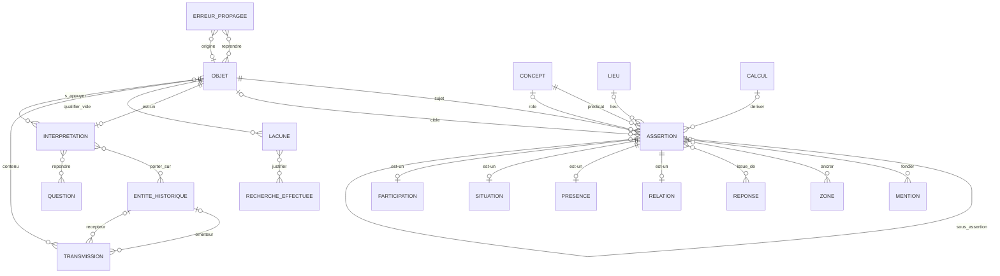

## 9.3 Entités

| Entité | Obj. | Définition | Propriétés |
|---|---|---|---|
| ASSERTION | ✓ | Proposition structurée sur le monde historique, attribuée, sourcée et datée. Plusieurs assertions incompatibles coexistent (§ 8, § 105.5). | libelle_source (vocabulaire exact), niveau {attestée, normalisée, interprétée}, nature {attestée, dérivée, synthétique, choisie pour affichage}, modalite ⟨D-30⟩, polarite {positive, négative}, plausibilite ⟨D-19⟩, temps_historique (`DATE_HIST`), valeur (`VALEUR`, optionnelle), etat_provenance ⟨D-14⟩ |
| INTERPRETATION | ✓ | Production raisonnée qui agrège des assertions ou d'autres interprétations. Spécialisée en : **HYPOTHESE**, **CONCLUSION**, **PHASE_TRAJECTOIRE**, **SYNTHESE**, **NARRATION**, **ESTIMATION** (§ 10.4, § 25.10, § 45, § 93.5, § 38). | type {hypothèse, conclusion, phase de trajectoire, synthèse, narration, estimation}, enonce, raisonnement, certitude ⟨D-19⟩, questions_ouvertes, etat_provenance ⟨D-14⟩ ; *PHASE_TRAJECTOIRE* : titre, periode (`DATE_HIST`), mode {manuelle, proposée} ; *SYNTHESE* : portee {documentaire stricte, projet, communautaire, Tree, chercheur}, regle_construction ; *NARRATION* : texte, generee_par_ia |
| LACUNE | ✓ | Qualification d'un vide : pourquoi ce qu'on ne sait pas est vide (§ 11.1). | type_vide ⟨D-31⟩, dimension (prédicat ou aspect concerné), perimetre |
| ERREUR_PROPAGEE | ✓ | Erreur dont on suit l'origine, les reprises et la correction, pour ne pas compter 20 copies comme 20 confirmations (§ 111). | description, etat {suspectée, établie, corrigée} |
| TRANSMISSION | ✓ | Maillon de circulation d'une information ou d'un récit : A raconte à B ; un journal était disponible ; X l'a lu (§ 108, § 109, Q123). | niveau ⟨D-32⟩, mode {oral, manuscrit, imprimé, image, numérique, autre}, date (`DATE_HIST`) |

## 9.4 Associations

| Association | Pattes | Propriétés portées |
|---|---|---|
| SUJET | OBJET (0,n) — ASSERTION (1,1) | — |
| CIBLE | OBJET (0,n) — ASSERTION (0,1) | — |
| PREDICAT | CONCEPT (0,n) — ASSERTION (1,1) | — |
| ROLE | CONCEPT (0,n) — ASSERTION (0,1) | — |
| LIEU_DE | LIEU (0,n) — ASSERTION (0,1) | — |
| SOUS_ASSERTION | ASSERTION parente (0,n) — ASSERTION composante (0,1) | rang |
| FONDER | ASSERTION (0,n) — MENTION (0,n) | role_probatoire ⟨D-08⟩ |
| ANCRER | ASSERTION (0,n) — ZONE (0,n) | role_probatoire ⟨D-08⟩, rang |
| ISSUE_DE | ASSERTION (0,n) — REPONSE (0,n) | — |
| DERIVER | CALCUL (0,n) — ASSERTION (0,1) | — |
| S_APPUYER | INTERPRETATION (0,n) — OBJET (0,n) | sens {appui, contre, contexte} |
| PORTER_SUR | INTERPRETATION (0,n) — ENTITE_HISTORIQUE (0,n) | — |
| REPONDRE | INTERPRETATION (0,n) — QUESTION (0,n) | — |
| QUALIFIER_VIDE | OBJET (0,n) — LACUNE (1,1) | — |
| JUSTIFIER | LACUNE (0,n) — RECHERCHE_EFFECTUEE (0,n) | — |
| ORIGINE / REPRENDRE | ERREUR_PROPAGEE (0,1) — OBJET (0,n) ; ERREUR_PROPAGEE (0,n) — OBJET (0,n) | transformation |
| CONTENU / EMETTEUR / RECEPTEUR | OBJET (0,n) — TRANSMISSION (1,1) ; ENTITE_HISTORIQUE (0,n) — TRANSMISSION (0,1) ×2 | — |

## 9.5 Règles de gestion

- **RG-G01** — Une assertion `attestée` est ancrée sur au moins une `ZONE` ou fondée sur au moins une `MENTION`, ou issue d'une `REPONSE` de Journal ; sinon son `etat_provenance` n'est pas `sourcée` et l'interface le montre. (§ 1.3 eng. 3, Q119)
- **RG-G02** — Une assertion `dérivée` est produite par exactement un `CALCUL` et a des `DEPENDANCE` vers ses entrées. Elle ne remplace jamais l'assertion attestée : « âgé de 30 ans » et « né vers 1851–1852 » coexistent. (§ 4, § 9.2)
- **RG-G03** — Les valeurs monétaires et métriques conservent valeur, unité et monnaie originales ; toute conversion est une assertion dérivée datée et méthodologiquement explicitée. (§ 9.4)
- **RG-G04** — Une nouvelle assertion contradictoire n'invalide pas l'ancienne : les deux coexistent, chacune avec sa source. (§ 8, § 105.5)
- **RG-G05** — Trois `SITUATION` ponctuelles d'emploi ne produisent pas de `SITUATION` continue ; une continuité est une assertion distincte de `continuite = continuité hypothétique` ou une `INTERPRETATION`. (§ 10.3, CU-15)
- **RG-G06** — Une `RELATION` de causalité exige `statut_causal`, une source ou un auteur, et une justification ; une cooccurrence ou une proximité ne crée jamais de `RELATION`. (§ 13.4, § 14, critères 29–30)
- **RG-G07** — « Le témoin déclare X » est une assertion de `modalite` `déclarée par un tiers dans la source`, dont le déclarant est porté par `RESPONSABILITE` ; « X s'est produit » est une autre assertion. (§ 16, § 35.2)
- **RG-G08** — Une `NARRATION` n'est jamais sujet d'un `ANCRER` ni cible d'un `S_APPUYER` probatoire : le récit n'est jamais une preuve. (§ 93.5)
- **RG-G09** — Une `TRANSMISSION` de niveau `exposition possible` n'est pas promue `réception attestée` sans trace. Quatre détenteurs d'un récit oral ne sont pas quatre témoignages indépendants. (§ 108, § 109)
- **RG-G10** — Une `LACUNE` de type `explicitement absent` exige une source ; une `LACUNE` de type `recherche exhaustive sans résultat` exige au moins une `RECHERCHE_EFFECTUEE` dont le périmètre la borne. (§ 11.2)
- **RG-G11** — « Première / dernière attestation connue » sont calculées à partir des assertions ; elles ne créent jamais d'événement « arrivée » ou « disparition ». (CU-23)

## 9.6 Consolidation canonique — justification, information et expression

- Toute conclusion peut posséder une `BASE_JUSTIFICATIVE` versionnée.
- Une source privée peut appartenir à l'histoire de production d'une conclusion sans appartenir à sa base justificative publique actuelle.
- `TRANSMISSION` est complétée par la notion de **lignée informationnelle** : plusieurs documents peuvent répéter la même chaîne d'information et ne constituent donc pas nécessairement des preuves indépendantes.
- L'émetteur matériel d'une assertion, son informateur et l'auteur du document peuvent être trois acteurs/personnes différents.
- La formulation linguistique d'une assertion (`EXPRESSION_ASSERTION`) est distincte de sa proposition structurée : transcription, normalisation et traduction n'écrasent pas l'assertion.

---

# 10. Domaine H — Validation, débat, crédit, réputation

## 10.1 Diagramme

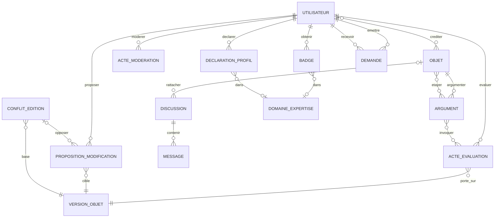

## 10.2 Entités

| Entité | Obj. | Définition | Propriétés |
|---|---|---|---|
| ACTE_EVALUATION | ✓ | Acte daté d'un cycle de validation sur une **version** d'objet : proposer, valider, contester, demander un réexamen, confirmer, corriger, déclarer indéterminé (§ 50, § 51). | type ⟨D-33⟩, date, justification, processus_applicable, independance {indépendance déclarée, lien connu, inconnue} |
| ARGUMENT | ✓ | Élément pour ou contre une hypothèse (identification, rapprochement, candidature, conclusion, reconstruction). Préféré à tout score (§ 6, § 50). | sens {pour, contre, contexte}, nature {critère compatible, critère incompatible, indice, preuve discriminante, méthodologique}, enonce |
| PROPOSITION_MODIFICATION | ✓ | Correction proposée par un tiers, avec justification et preuve (§ 63). | contenu_propose, justification, statut {soumise, en discussion, acceptée, refusée, retirée} |
| CONFLIT_EDITION | ✓ | Conflit scientifique entre propositions concurrentes sur une même version de base. Pas de « last write wins » (§ 64). | etat {ouvert, résolu par choix, résolu par fusion compatible, indétermination conservée} |
| DISCUSSION | ✓ | Fil rattaché si possible à un objet de travail (§ 57). | titre, statut |
| MESSAGE | — | Message d'une discussion. | `#id_message`, date, texte |
| ACTE_MODERATION | — | Acte de modération ; sans effet sur le statut scientifique (§ 49.2). | `#id_moderation`, type, motif, date, recours |
| DOMAINE_EXPERTISE | — | Contexte d'expertise : thème, période, territoire, langue, type de source (§ 34). | `#id_domaine`, theme, periode, territoire, langue, type_source |
| BADGE | ✓ | Expérience constatée ou qualification attribuée selon procédure ; jamais une preuve (§ 53.1). | famille {expérience constatée, qualification attribuée}, libelle, critere_ou_procedure, date_attribution, date_revocation |
| DECLARATION_PROFIL | ✓ | Intérêt ou compétence déclarés, visibilité et disponibilité aux sollicitations (§ 58). | type {intérêt, compétence}, visibilite, disponible_sollicitation |
| DEMANDE | ✓ | Demande ciblée entre utilisateurs, sans messagerie ouverte (§ 59). | categorie {source, vérification, photo-identification, avis, mission d'archives, collaboration}, message, identite_revelee, statut {envoyée, acceptée, refusée, close} |

## 10.3 Associations

| Association | Pattes | Propriétés portées |
|---|---|---|
| EVALUER | UTILISATEUR (0,n) — ACTE_EVALUATION (1,1) | role_au_moment (rôle de gouvernance) |
| PORTER_SUR_VERSION | ACTE_EVALUATION (1,1) — VERSION_OBJET (0,n) | — |
| ARGUMENTER | OBJET visé (0,n) — ARGUMENT (1,1) | — |
| ETAYER | ARGUMENT (0,n) — OBJET (preuve) (0,n) | — |
| INVOQUER | ARGUMENT (0,n) — ACTE_EVALUATION (0,n) | — |
| PROPOSER | UTILISATEUR (0,n) — PROPOSITION_MODIFICATION (1,1) ; décideur UTILISATEUR (0,n) — (0,1) | — |
| CIBLER_VERSION | PROPOSITION_MODIFICATION (1,1) — VERSION_OBJET (0,n) | — |
| BASE / OPPOSER | CONFLIT_EDITION (1,1) — VERSION_OBJET (0,n) ; CONFLIT_EDITION (2,n) — PROPOSITION_MODIFICATION (0,1) | — |
| RATTACHER_DISCUSSION / CONTENIR_MESSAGE | OBJET (0,n) — DISCUSSION (0,1) ; DISCUSSION (0,n) — MESSAGE (1,1) ; UTILISATEUR (0,n) — MESSAGE (1,1) | — |
| MODERER | UTILISATEUR (0,n) — ACTE_MODERATION (1,1) — OBJET (0,n) / UTILISATEUR (0,n) | — |
| CREDITER | UTILISATEUR (0,n) **ou** PERSONNE (0,n) — OBJET (0,n) | role_credit ⟨D-34⟩ |
| OBTENIR | UTILISATEUR (0,n) — BADGE (1,1) ; BADGE (0,1) — DOMAINE_EXPERTISE (0,n) | — |
| DECLARER_PROFIL | UTILISATEUR (0,n) — DECLARATION_PROFIL (1,1) ; DECLARATION_PROFIL (0,1) — DOMAINE_EXPERTISE (0,n) | — |
| EMETTRE / RECEVOIR | UTILISATEUR (0,n) — DEMANDE (1,1) ×2 ; DEMANDE (0,1) — OBJET (0,n) | — |

## 10.4 Règles de gestion

- **RG-H01** — Le `statut_validation` d'un objet est dérivé de la séquence de ses `ACTE_EVALUATION` ; « validé » signifie « processus applicable satisfait à cette date » et peut évoluer. (§ 50)
- **RG-H02** — Le nombre d'actes de validation n'est jamais affiché sans l'indépendance connue : des validateurs d'un même `GROUPE` de type `équipe` ou ayant un `LIEN_INTERET` sur l'objet sont signalés. « Aucune dépendance connue » ≠ « indépendant ». (§ 33, § 55.2, § 112)
- **RG-H03** — Une contestation appuyée sur une preuve nouvelle ouvre un réexamen quelle que soit la majorité antérieure. (§ 51, § 52)
- **RG-H04** — Un `ACTE_EVALUATION` passé n'est jamais supprimé quand une preuve devient inaccessible ; la vérifiabilité actuelle est calculée séparément à partir de l'`etat_acces` des preuves. (§ 75, CU-20)
- **RG-H05** — Un `ACTE_MODERATION` ne modifie ni le statut de validation ni les `ARGUMENT`. (§ 49.2)
- **RG-H06** — Il n'existe aucun score global d'utilisateur : le modèle ne contient ni points ni classement. (§ 53)
- **RG-H07** — Un compte non vérifié ou jetable ne peut pas émettre d'`ACTE_EVALUATION` de type `validation` ou `confirmation` sur le Core partagé. (§ 56)
- **RG-H08** — Une `PROPOSITION_MODIFICATION` acceptée conserve le `CREDIT` du proposant. (§ 63)

---

# 11. Domaine I — Reconstruction et cohérence documentaire

## 11.1 Diagramme

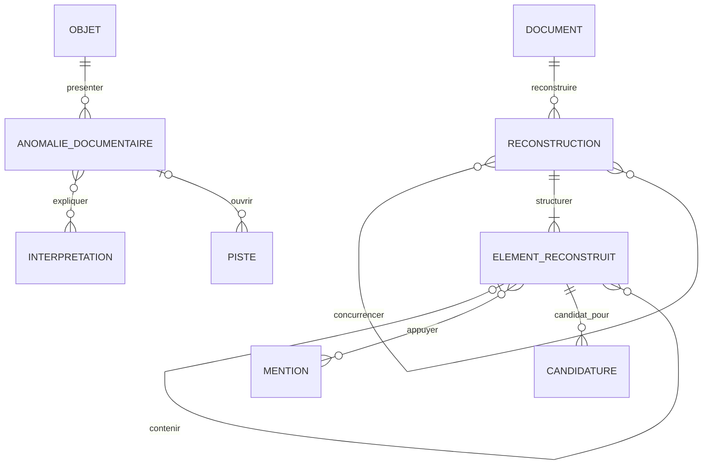

## 11.2 Entités

| Entité | Obj. | Définition | Propriétés |
|---|---|---|---|
| RECONSTRUCTION | ✓ | Reconstruction, par un auteur et selon une méthode, d'un document perdu ou lacunaire. Plusieurs reconstructions peuvent concurrencer (§ 20, CU-03). | titre, methode, statut {proposée, en discussion, validée, abandonnée} |
| ELEMENT_RECONSTRUIT | ✓ | ⊂ POSITION. Volume, section, colonne, page ou entrée d'une reconstruction. Une position inconnue reste inconnue. | niveau {volume, section, colonne, page, entrée}, numero, rang, statut_contenu {attesté par une trace, reconstruit (hypothèse), inconnu} |
| ANOMALIE_DOCUMENTAIRE | ✓ | Anomalie détectée dans une série ou un document ; jamais une conclusion (§ 21). | type ⟨D-35⟩, description, detectee_par {moteur de règles, humain}, statut {signalée, en examen, expliquée, sans explication} |

## 11.3 Associations

| Association | Pattes | Propriétés portées |
|---|---|---|
| RECONSTRUIRE | DOCUMENT (0,n) — RECONSTRUCTION (1,1) | — |
| CONCURRENCER | RECONSTRUCTION (0,n) — RECONSTRUCTION (0,n) | — |
| STRUCTURER | RECONSTRUCTION (1,n) — ELEMENT_RECONSTRUIT (1,1) | — |
| CONTENIR_ELEMENT | ELEMENT_RECONSTRUIT parent (0,n) — enfant (0,1) | — |
| APPUYER | ELEMENT_RECONSTRUIT (0,n) — MENTION (0,n) | apport {cite le numéro, cite le nom, cite la parenté, cite une information}, role_probatoire ⟨D-08⟩ |
| PRESENTER | OBJET (`UNITE_ARCHIVISTIQUE` ou `DOCUMENT`) (0,n) — ANOMALIE_DOCUMENTAIRE (1,1) | — |
| EXPLIQUER | ANOMALIE_DOCUMENTAIRE (0,n) — INTERPRETATION (hypothèse) (0,n) | — |
| OUVRIR | ANOMALIE_DOCUMENTAIRE (0,1) — PISTE (0,n) | — |

Le contenu d'un élément (« n°8 : Rose, 12 ans, fille de … ») est porté par des `ASSERTION` dont le **sujet** est l'`ELEMENT_RECONSTRUIT`, ancrées sur les actes ultérieurs. L'attribution de l'entrée à une personne passe par `CANDIDATURE`.

## 11.4 Règles de gestion

- **RG-I01** — Une `RECONSTRUCTION` ne porte que sur un `DOCUMENT` dont `statut_existence` n'est pas `conservé et localisé`, ou qui est `lacunaire`. (§ 20.1)
- **RG-I02** — Un `ELEMENT_RECONSTRUIT` de statut `reconstruit` ou `inconnu` n'est jamais présenté comme ligne originale ; aucune position n'est créée pour « compléter » une série sans trace. (§ 20.3, § 31)
- **RG-I03** — Chaque `APPUYER` crée une `DEPENDANCE` ; la correction de la lecture d'un acte source rend l'élément `potentiellement affecté`, puis ses identifications, statistiques et conclusions. (§ 32, CU-03)
- **RG-I04** — Une `ANOMALIE_DOCUMENTAIRE` ne modifie jamais le `statut_existence` d'un document (« 87 manquant » ≠ « 87 détruit »). (§ 21, CU-25)

---

# 12. Domaine J — Journal (mémoire)

Une mémoire est une **source** : chaque session produit un `DOCUMENT` de nature `témoignage` qui suit la chaîne documentaire normale (reproduction audio, zones = minutes, transcription, mentions). Journal ajoute la structure de l'élicitation : question exacte, réponse spontanée, indice, réaction.

## 12.1 Diagramme

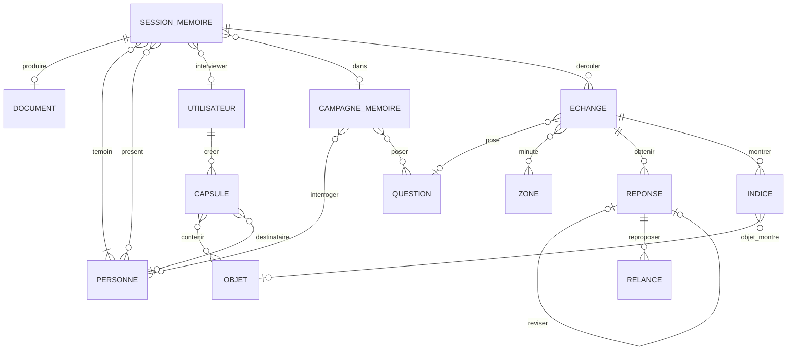

## 12.2 Entités

| Entité | Obj. | Définition | Propriétés |
|---|---|---|---|
| SESSION_MEMOIRE | ✓ | Moment de recueil : auto-mémoire, entretien d'un tiers, discussion collective, capture libre (§ 24.1–24.4). | type {auto-mémoire, entretien d'un tiers, discussion collective, capture libre, réponse de campagne}, date (`DATE_HIST`), lieu (texte ou `LIEU`), mode {présentiel, téléphone, visio, écrit, audio seul}, contexte, statut_temoin {personne concernée, témoin direct, témoin indirect, inconnu} |
| ECHANGE | ✓ | Une question posée et ce qui s'en suit, dans l'ordre (§ 24.4). | rang, question_texte_exact (vide si non enregistrée), caractere_question {ouverte, fermée, suggestive, inconnu} |
| REPONSE | ✓ | Réponse à un échange, avant ou après indice, avec état de mémoire et mode de connaissance (§ 20, § 21, § 24.5, § 24.6). | phase {spontanée, après indice}, texte, etat_memoire ⟨D-36⟩, mode_connaissance ⟨D-37⟩ |
| INDICE | ✓ | Élément montré au témoin (nom, photo, arbre, hypothèse) ; marque la frontière spontané / suggéré (§ 24.3). | type {nom, photo, arbre, hypothèse, document, autre}, description, moment |
| RELANCE | ✓ | Re-proposition planifiée d'une question oubliée ou non résolue (§ 21, § 24.6). | date_prevue, note_delicatesse, statut {prévue, faite, abandonnée} |
| CAMPAGNE_MEMOIRE | ✓ | Campagne de questions vers plusieurs personnes ; réponses indépendantes avant confrontation (§ 24.13). | titre, phase {réponses indépendantes, confrontation collective, close}, periode |
| CAPSULE | ✓ | Contenu destiné à un destinataire futur, délivré sous condition ; distinct de l'embargo (§ 24.14). | titre, condition_type {date, âge du destinataire, décès de l'auteur, autre}, condition_valeur, destinataire_description, etat {scellée, délivrable, délivrée, annulée} |

## 12.3 Associations

| Association | Pattes | Propriétés portées |
|---|---|---|
| PRODUIRE_DOC | SESSION_MEMOIRE (0,1) — DOCUMENT (0,1) | — |
| TEMOIN | SESSION_MEMOIRE (1,n) — PERSONNE (0,n) | — |
| PRESENT | SESSION_MEMOIRE (0,n) — PERSONNE (0,n) | role {présent, intervenant, traducteur} |
| INTERVIEWER | SESSION_MEMOIRE (0,1) — UTILISATEUR (0,n) | — |
| DANS_CAMPAGNE | SESSION_MEMOIRE (0,1) — CAMPAGNE_MEMOIRE (0,n) | — |
| DEROULER | SESSION_MEMOIRE (0,n) — ECHANGE (1,1) | — |
| POSER_QUESTION | ECHANGE (0,1) — QUESTION (0,n) | — |
| MINUTE | ECHANGE (0,n) — ZONE (0,n) | — |
| OBTENIR | ECHANGE (0,n) — REPONSE (1,1) | — |
| MONTRER_INDICE | ECHANGE (0,n) — INDICE (1,1) ; INDICE (0,1) — OBJET (0,n) | — |
| REVISER | REPONSE nouvelle (0,1) — REPONSE antérieure (0,1) | nature {nouvelle déclaration, précision, rétractation} |
| REPROPOSER | REPONSE (0,n) — RELANCE (1,1) | — |
| INTERROGER | CAMPAGNE_MEMOIRE (0,n) — PERSONNE (0,n) | statut {invitée, a répondu, a décliné} |
| POSER | CAMPAGNE_MEMOIRE (0,n) — QUESTION (0,n) | portee {commune, personnalisée} |
| CREER_CAPSULE / CONTENIR_CAPSULE | UTILISATEUR (0,n) — CAPSULE (1,1) ; CAPSULE (1,n) — OBJET (0,n) ; CAPSULE (0,1) — PERSONNE (0,n) | — |

## 12.4 Règles de gestion

- **RG-J01** — Une `REPONSE` de phase `après indice` est toujours liée à un `INDICE` du même échange ; la réponse spontanée, si elle existe, est conservée intacte. (§ 20, § 24.3)
- **RG-J02** — Une question manquante n'est jamais reconstituée comme certaine : `question_texte_exact` reste vide et `caractere_question = inconnu`. (§ 24.4)
- **RG-J03** — Une correction de transcription est une nouvelle `VERSION_OBJET` du segment ; un changement de déclaration est une nouvelle `REPONSE` liée par `REVISER`. La déclaration initiale n'est jamais réécrite. (§ 24.7, § 24.8)
- **RG-J04** — `etat_memoire` ≠ `refuse` et ≠ `jamais su` ne sont pas confondus ; aucun attribut n'interprète psychologiquement un silence. (§ 21, § 24.9)
- **RG-J05** — Pendant la phase `réponses indépendantes` d'une campagne, un participant n'accède pas aux réponses des autres ; la discussion collective est une nouvelle `SESSION_MEMOIRE` (nouvelle source). (§ 22, § 24.13)
- **RG-J06** — Une `CAPSULE` délivrée ne lève aucun `EMBARGO` sur son contenu ; capsule et embargo sont deux mécanismes distincts. (§ 24.14)
- **RG-J07** — Le témoignage d'une personne concernée (`statut_temoin = personne concernée`) a une valeur documentaire propre mais n'efface aucune assertion existante. (§ 68)

---

# 13. Domaine K — Echo (recherche)

## 13.1 Diagramme

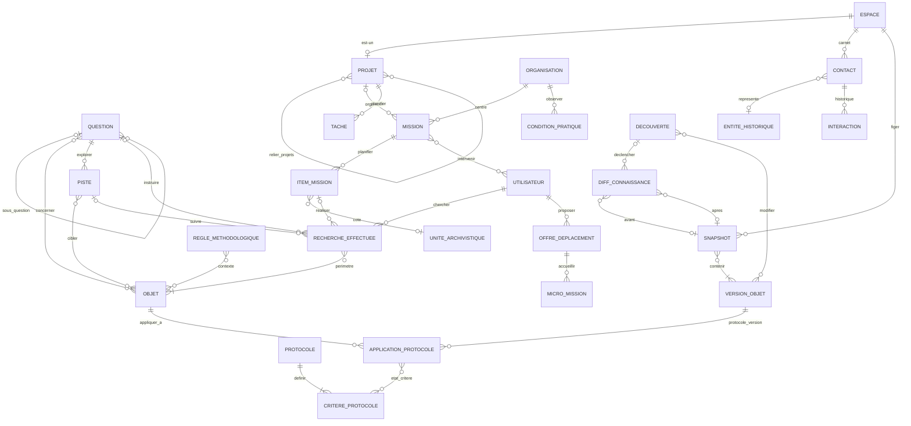

## 13.2 Entités

| Entité | Obj. | Définition | Propriétés |
|---|---|---|---|
| PROJET | ✓ | ⊂ ESPACE. Projet de recherche ou de mémoire, transmissible, avec cycle de vie historisé (§ 25.19). | intitule, objet_focal, perimetre, etat_cycle ⟨D-38⟩, date_cloture |
| QUESTION | ✓ | Question de recherche ou question de mémoire (« Qui était Ti-René ? »). Objet autonome, réouvrable (§ 24, § 25.9). | libelle, portee {recherche, mémoire}, etat ⟨D-39⟩, recherchabilite ⟨D-40⟩, motif_reouverture |
| PISTE | ✓ | Piste d'une question, avec statut de branche et priorité explicable (§ 25.9, Q140). | description, statut {à explorer, en cours, réussie, suspendue, réfutée, bloquée}, priorite, justification_priorite, source_suggeree (texte : « suggérée ≠ existe ») |
| RECHERCHE_EFFECTUEE | ✓ | Recherche réellement menée, positive ou négative, avec périmètre, variantes, niveau de consultation et limites (§ 11.3, § 23, § 25.3). Porte aussi le « fragment effectivement consulté ». | date, objectif, termes_et_variantes, niveau_consultation ⟨D-41⟩, couverture (périmètre exact : pages, années, index), resultat {positif, négatif, partiel, non concluant}, limites |
| MISSION | ✓ | Mission d'archives : préparation, déroulé, compte rendu, coût, délégation (§ 25.2, § 25.4). | objectifs, date_prevue, dates_effectives, statut {préparée, en cours, réalisée, annulée}, cout (`VALEUR`), contraintes, compte_rendu |
| ITEM_MISSION | ✓ | Cote ou document à traiter pendant la mission, avec son état de consultation. | rang, priorite, statut ⟨D-42⟩, notes |
| OFFRE_DEPLACEMENT | ✓ | Un utilisateur annonce un passage aux archives et accepte des micro-missions (§ 25.5). | date, categories_acceptees, capacite, visibilite (privée par défaut) |
| MICRO_MISSION | ✓ | Petite demande confiée à un porteur d'offre. | consigne, cible (texte ou cote), statut {proposée, acceptée, réalisée, refusée} |
| CONDITION_PRATIQUE | ✓ | Condition observée d'un centre d'archives, historisée (Q142). | type {horaires, réservation, délai de communication, photo autorisée, quota, fermeture, tarif, autre}, valeur, date_observation |
| CONTACT | ✓ | Interlocuteur du carnet Echo (institution, archiviste, association, famille, chercheur) ; privé à son espace (§ 25.1). | nom_affiche, type {institution, archiviste, association, famille, chercheur, autre}, coordonnees_privees |
| INTERACTION | ✓ | Demande, réponse, relance ou note privée avec un contact. | type {demande, réponse, relance, échange, note privée}, date, contenu, echeance_relance |
| PROTOCOLE | ✓ | Protocole versionné, partageable, citable, conditionnel : définit « suffisamment traité » ou « exploité exhaustivement selon X » (§ 16, § 25.7, § 25.11). | titre, portee {personnel, équipe, communauté, pays, période, type de problème}, conditions_application |
| CRITERE_PROTOCOLE | ✓ | Étape ou dimension d'un protocole (état civil vérifié, marges extraites, variantes recherchées…). | rang, libelle, dimension, condition |
| APPLICATION_PROTOCOLE | ✓ | Application d'une version de protocole à une question (critère d'arrêt) ou à un document (couverture d'exploitation). | statut {en cours, accompli selon protocole, interrompu}, date |
| REGLE_METHODOLOGIQUE | ✓ | Régularité détectée, règle proposée ou règle adoptée humainement, avec portée explicite ; inclut l'apprentissage par corrections (§ 23.7, § 25.8). | enonce, niveau {pattern détecté, règle proposée, règle adoptée}, origine {détection automatique, corrections humaines, proposition humaine}, portee ⟨D-43⟩ |
| TACHE | ✓ | Tâche de projet, y compris générée par un signal (« retrouver le fondement »). | libelle, statut, echeance, origine {manuelle, signal de dépendance, preuve inaccessible, réouverture, anomalie} |
| SNAPSHOT | ✓ | État intellectuel figé, nommé, daté, citable (§ 25.15). | nom, date, description |
| DIFF_CONNAISSANCE | ✓ | Explication enregistrée d'un changement entre deux états (§ 25.16, Q200). | resume, nature {technique, scientifique, mixte}, consequences |
| DECOUVERTE | ✓ | Découverte formalisée, sans revendication automatique de priorité (§ 25.17). | enonce, date, portee_nouveaute ⟨D-44⟩, priorite_externe {non évaluée, antériorité connue, non revendiquée} |

## 13.3 Associations

| Association | Pattes | Propriétés portées |
|---|---|---|
| RELIER_PROJETS | PROJET (0,n) — PROJET (0,n) | type {issu de, prolonge, complète, réexamine, conteste, réutilise le corpus de, sous-projet de, succède à} |
| SOUS_QUESTION | QUESTION parente (0,n) — QUESTION (0,1) | — |
| CONCERNER | QUESTION (0,n) — OBJET (0,n) | — |
| EXPLORER | QUESTION (0,n) — PISTE (1,1) ; PISTE (0,1) — RECHERCHE_EFFECTUEE ou ANOMALIE (origine) | — |
| CIBLER | PISTE (0,n) — OBJET (`UNITE_ARCHIVISTIQUE`, `ORGANISATION`, `CONCEPT`) (0,n) | — |
| INSTRUIRE / SUIVRE | QUESTION (0,n) — RECHERCHE_EFFECTUEE (0,1) ; PISTE (0,n) — RECHERCHE_EFFECTUEE (0,1) | — |
| PERIMETRE | RECHERCHE_EFFECTUEE (1,n) — OBJET (`UNITE_ARCHIVISTIQUE`, `EXEMPLAIRE`, `REPRODUCTION`, `CORPUS`, index) (0,n) | pages_ou_annees_couvertes |
| CHERCHER | UTILISATEUR (0,n) — RECHERCHE_EFFECTUEE (1,1) | — |
| ORGANISER / CENTRE | PROJET (0,n) — MISSION (0,1) ; ORGANISATION (0,n) — MISSION (1,1) | — |
| PLANIFIER_ITEM | MISSION (0,n) — ITEM_MISSION (1,1) ; ITEM_MISSION (0,1) — UNITE_ARCHIVISTIQUE (0,n) ; ITEM_MISSION (0,1) — QUESTION (0,n) | — |
| REALISER_ITEM | ITEM_MISSION (0,n) — RECHERCHE_EFFECTUEE (0,1) ; ITEM_MISSION (0,n) — REPRODUCTION (0,1) | — |
| INTERVENIR | MISSION (0,n) — UTILISATEUR (0,n) | role {commanditaire, consultant, photographe, transcripteur, interprète, validateur}, statut {soi, tiers, professionnel, bénévole}, acces_debut, acces_fin, perimetre_acces |
| PROPOSER_OFFRE / ACCUEILLIR | UTILISATEUR (0,n) — OFFRE_DEPLACEMENT (1,1) ; OFFRE_DEPLACEMENT (0,n) — ORGANISATION (1,1) ; OFFRE_DEPLACEMENT (0,n) — MICRO_MISSION (1,1) ; demandeur UTILISATEUR (0,n) — MICRO_MISSION (1,1) | — |
| OBSERVER | ORGANISATION (0,n) — CONDITION_PRATIQUE (1,1) | — |
| CARNET / REPRESENTE / HISTORIQUE | ESPACE (0,n) — CONTACT (1,1) ; CONTACT (0,1) — ENTITE_HISTORIQUE (0,n) ; CONTACT (0,1) — UTILISATEUR (0,n) ; CONTACT (0,n) — INTERACTION (1,1) | — |
| DEFINIR | PROTOCOLE (1,n) — CRITERE_PROTOCOLE (1,1) | — |
| APPLIQUER_A | OBJET (`QUESTION` ou `DOCUMENT`) (0,n) — APPLICATION_PROTOCOLE (1,1) ; VERSION_OBJET (de protocole) (0,n) — APPLICATION_PROTOCOLE (1,1) | — |
| ETAT_CRITERE | APPLICATION_PROTOCOLE (0,n) — CRITERE_PROTOCOLE (0,n) | etat {accompli, partiel, non fait, non applicable}, couverture, preuve (→ OBJET) |
| CONTEXTE_REGLE | REGLE_METHODOLOGIQUE (0,n) — OBJET (main, registre, corpus, `LIEU`) (0,n) ; adoptant UTILISATEUR (0,n) — REGLE (0,1) | — |
| PLANIFIER_TACHE | PROJET (0,n) — TACHE (1,1) ; TACHE (0,1) — UTILISATEUR (0,n) ; TACHE (0,n) — OBJET (0,n) | — |
| FIGER / CONTENIR_SNAP | ESPACE (0,n) — SNAPSHOT (1,1) ; SNAPSHOT (1,n) — VERSION_OBJET (0,n) | — |
| AVANT / APRES | DIFF_CONNAISSANCE (0,1) — SNAPSHOT (0,n) ×2 (à défaut, deux dates) | — |
| DECLENCHER / MODIFIER | DECOUVERTE (0,1) — DIFF_CONNAISSANCE (0,n) ; DECOUVERTE (0,n) — VERSION_OBJET (état antérieur modifié) (0,n) ; UTILISATEUR (0,n) — DECOUVERTE (1,1) | — |

## 13.4 Règles de gestion

- **RG-K01** — Une `RECHERCHE_EFFECTUEE` négative ne produit jamais d'assertion de polarité négative ni de `LACUNE` « explicitement absent » ; au mieux une `LACUNE` « recherche exhaustive sans résultat dans le périmètre » si `niveau_consultation = consultation exhaustive`. (§ 11.2, § 23, § 25.3, critère 19)
- **RG-K02** — Une `QUESTION` ne passe à `suffisamment traitée selon protocole` que via une `APPLICATION_PROTOCOLE` accomplie ; aucun pourcentage d'avancement n'est stocké. (§ 25.11, § 25.13, § 54)
- **RG-K03** — Une question `résolue` passe à `à réexaminer` quand une `DEPENDANCE` de son `INTERPRETATION` de conclusion devient `potentiellement affectée` par un changement **scientifique** ; pas pour une correction technique. (§ 25.14)
- **RG-K04** — La réouverture d'un projet clôturé crée une nouvelle version d'état ; l'état de clôture précédent reste consultable. (critère 21)
- **RG-K05** — Les accès d'un intervenant de mission délégué sont bornés par `acces_debut`, `acces_fin` et `perimetre_acces`. Une `OFFRE_DEPLACEMENT` n'expose aucun projet privé. (§ 25.4, § 25.5)
- **RG-K06** — Une `PISTE` qui suggère une source ne crée aucun `DOCUMENT` ni aucune `EXISTENCE_DOCUMENTAIRE`. (§ 25.6)
- **RG-K07** — Une `REGLE_METHODOLOGIQUE` ne passe à `règle adoptée` que par un acte humain identifié ; sa portée ne s'étend jamais automatiquement. (§ 23.7, § 25.8)
- **RG-K08** — Une `REGLE_METHODOLOGIQUE` ou un `PROTOCOLE` modifié crée une nouvelle version ; les applications passées restent liées à leur version. Jamais de modification silencieuse. (§ 25.7)

---

# 14. Domaine L — Tree

Choix de modélisation : un `ARBRE` est une **structure de navigation** dans un espace privé ou familial. Ses individus sont des `PERSONNE` de cet espace, et ses liens sont des `RELATION` de parenté ou d'alliance de cet espace. Tree utilise donc tout le modèle Core **sans contribuer** au Core partagé (§ 4.1, § 12, critère 23).

## 14.1 Diagramme

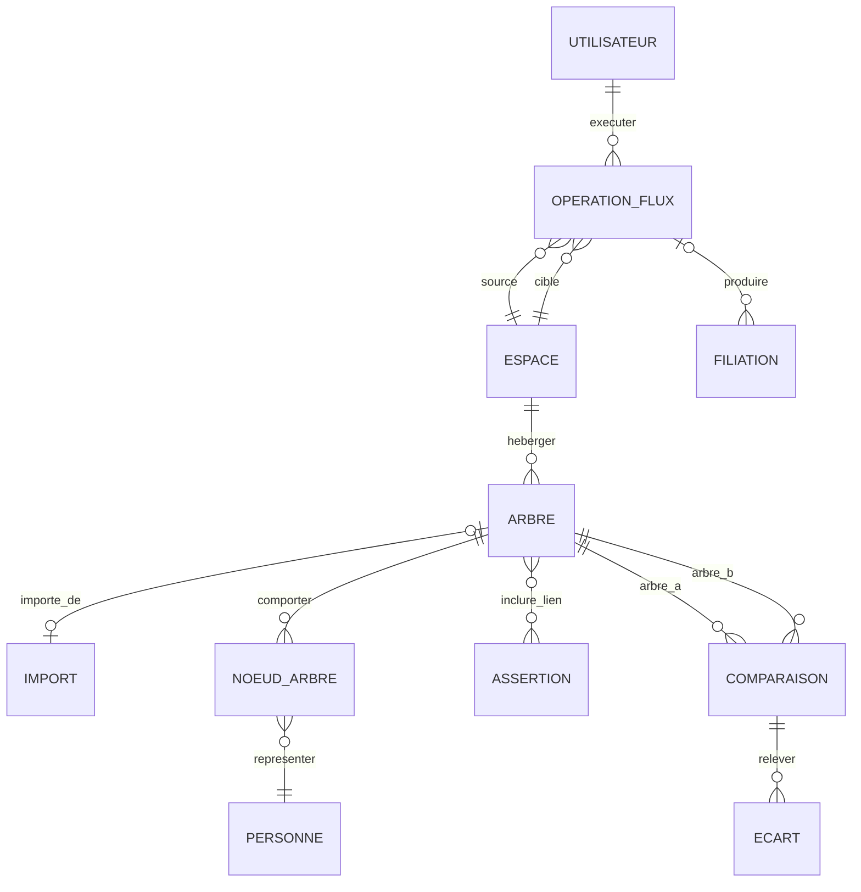

## 14.2 Entités

| Entité | Obj. | Définition | Propriétés |
|---|---|---|---|
| ARBRE | ✓ | Arbre généalogique souverain d'un espace ; jamais fusionné avec un arbre mondial (§ 26.1). | nom, origine {saisie, import GEDCOM, import autre}, personne_racine_affichage |
| NOEUD_ARBRE | ✓ | Présence d'une `PERSONNE` de l'espace dans un arbre, avec ses conventions d'affichage. | libelle_affichage, position_affichage |
| OPERATION_FLUX | ✓ | Opération explicite de circulation entre espaces : contribuer, importer, comparer, échanger, restaurer (§ 13, § 26.3). | type ⟨D-45⟩, date, statut {préparée, exécutée, annulée}, autorisation |
| COMPARAISON | ✓ | Comparaison autorisée de deux arbres (§ 26.5). | date, perimetre, statut |
| ECART | ✓ | Différence relevée par une comparaison. | type {seulement dans A, seulement dans B, valeur divergente, identique}, objet_a (→ OBJET), objet_b (→ OBJET) |

## 14.3 Associations

| Association | Pattes | Propriétés portées |
|---|---|---|
| HEBERGER | ESPACE (0,n) — ARBRE (1,1) | — |
| IMPORTE_DE | ARBRE (0,1) — IMPORT (0,1) | — |
| COMPORTER_NOEUD | ARBRE (0,n) — NOEUD_ARBRE (1,1) | — |
| REPRESENTER | NOEUD_ARBRE (1,1) — PERSONNE (0,n) | — |
| INCLURE_LIEN | ARBRE (0,n) — ASSERTION (`RELATION` de parenté ou d'alliance) (0,n) | — |
| EXECUTER | UTILISATEUR (0,n) — OPERATION_FLUX (1,1) | — |
| SOURCE / CIBLE | OPERATION_FLUX (1,1) — ESPACE (0,n) ×2 | — |
| PRODUIRE_FILIATION | OPERATION_FLUX (0,n) — FILIATION (0,1) | — |
| COMPARER | ARBRE A (0,n) — COMPARAISON (1,1) ; ARBRE B (0,n) — COMPARAISON (1,1) ; COMPARAISON (0,n) — ECART (1,1) | — |

## 14.4 Règles de gestion

- **RG-L01** — Une `PERSONNE` représentée par un `NOEUD_ARBRE` appartient au même espace que l'arbre. Le lien vers le Core partagé passe par un `RAPPROCHEMENT` (RG-F07), jamais par un nœud pointant une entité partagée. (§ 26.2)
- **RG-L02** — Une `OPERATION_FLUX` de type `import Core→privé` crée des copies liées par `FILIATION` ; un changement ultérieur dans le Core passe la filiation à `divergents` et notifie, sans modifier l'arbre. (§ 26.4, critère 9)
- **RG-L03** — Une `COMPARAISON` ou un `échange Tree↔Tree` ne crée aucun objet dans le Core partagé. (§ 26.5, critère 10)
- **RG-L04** — Un import GEDCOM sans sources produit des assertions d'`etat_provenance = non sourcée` ; l'import ne crée aucune source artificielle. (§ 84)

---

# 15. Domaine M — Connect

## 15.1 Diagramme

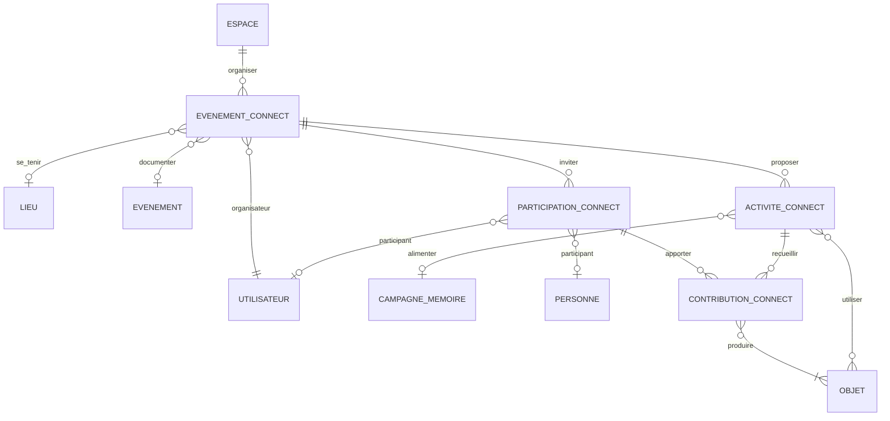

## 15.2 Entités

| Entité | Obj. | Définition | Propriétés |
|---|---|---|---|
| EVENEMENT_CONNECT | ✓ | Objet métier : cousinade, rencontre, commémoration. Peut documenter un `EVENEMENT` historique (la réunion familiale devient elle-même histoire) (§ 3.5). | type {cousinade, rencontre, commémoration, atelier, autre}, titre, date, statut |
| ACTIVITE_CONNECT | ✓ | Jeu, quiz, photo-identification, collecte d'anecdotes, campagne, avant / pendant / après l'événement. | type {jeu, quiz, photo-identification, collecte d'anecdotes, campagne de mémoire, exposition}, phase {avant, pendant, après}, consignes |
| PARTICIPATION_CONNECT | ✓ | Invitation et participation d'un utilisateur ou d'une personne non inscrite. | role {organisateur, animateur, participant}, statut {invité, inscrit, présent, absent} |
| CONTRIBUTION_CONNECT | ✓ | Ce qu'un participant apporte dans une activité ; produit des objets Journal ou Inbox. | date, statut {brute, qualifiée, rattachée} |

## 15.3 Associations

| Association | Pattes | Propriétés portées |
|---|---|---|
| ORGANISER / ORGANISATEUR | ESPACE (0,n) — EVENEMENT_CONNECT (1,1) ; UTILISATEUR (0,n) — EVENEMENT_CONNECT (1,1) | — |
| SE_TENIR / DOCUMENTER | EVENEMENT_CONNECT (0,1) — LIEU (0,n) ; EVENEMENT_CONNECT (0,1) — EVENEMENT (0,n) | — |
| PROPOSER_ACTIVITE | EVENEMENT_CONNECT (0,n) — ACTIVITE_CONNECT (1,1) ; ACTIVITE_CONNECT (0,1) — CAMPAGNE_MEMOIRE (0,n) ; ACTIVITE_CONNECT (0,n) — OBJET (0,n) | — |
| INVITER | EVENEMENT_CONNECT (0,n) — PARTICIPATION_CONNECT (1,1) ; PARTICIPATION_CONNECT (0,1) — UTILISATEUR (0,n) / PERSONNE (0,n) | — |
| RECUEILLIR / APPORTER / PRODUIRE_OBJ | ACTIVITE_CONNECT (0,n) — CONTRIBUTION_CONNECT (1,1) ; PARTICIPATION_CONNECT (0,n) — CONTRIBUTION_CONNECT (1,1) ; CONTRIBUTION_CONNECT (1,n) — OBJET (`INBOX_ITEM`, `SESSION_MEMOIRE`, `ASSERTION`…) (0,1) | — |

## 15.4 Règles de gestion

- **RG-M01** — Une contribution Connect n'entre dans aucun espace autre que celui de l'événement sans `CONSENTEMENT` de portée adaptée ; la contribution au Core partagé exige une `OPERATION_FLUX` séparée. (§ 1.3 eng. 4, matrice Partie XVI)
- **RG-M02** — Une photo-identification collective suit le même modèle qu'une campagne : réponses indépendantes conservées avant confrontation. (§ 24.13)

---

# 16. Domaine N — Atlas (spatialité)

Le lieu est une `ENTITE_HISTORIQUE` (domaine E). Ses noms, rattachements et relations spatiales sont des `ASSERTION` (profil `RELATION` avec `referentiel_spatial`). Atlas ajoute la **géométrie incertaine** et la **carte comme production dépendante**.

## 16.1 Diagramme

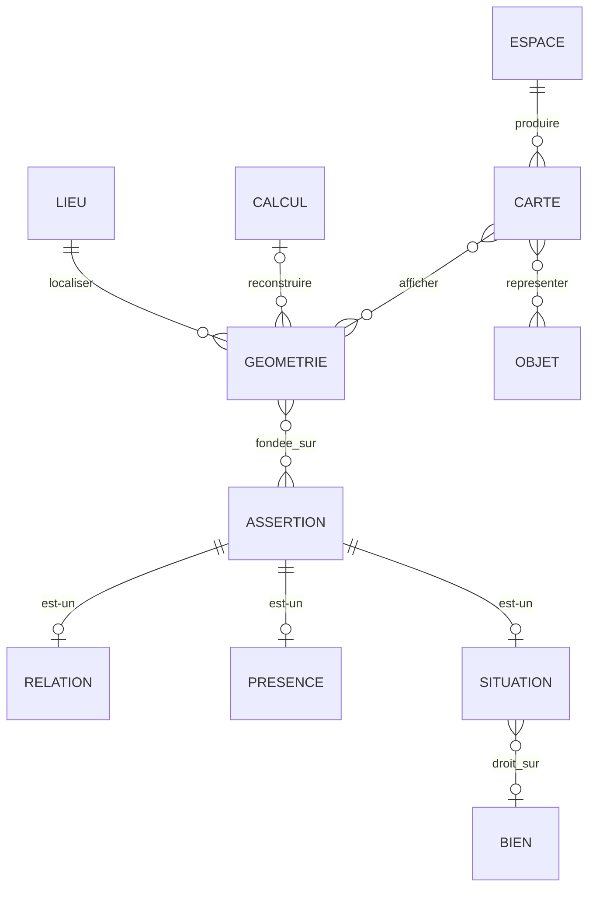

## 16.2 Entités

| Entité | Obj. | Définition | Propriétés |
|---|---|---|---|
| GEOMETRIE | ✓ | Une localisation d'un lieu pour une période, avec son type de précision. Plusieurs géométries concurrentes ou successives coexistent (§ 27.4, § 27.5). | type_localisation ⟨D-46⟩, geometrie (`GEOM`), precision_metres, periode (`DATE_HIST`), statut {proposée, examinée, contestée, rejetée} |
| CARTE | ✓ | Production cartographique : résultat de recherche dépendant de localisations, versionné, dynamique ou figé (§ 28, § 5.4). | titre, mode {dynamique, figée}, periode, couches, fraicheur {à jour, potentiellement obsolète} |

## 16.3 Associations

| Association | Pattes | Propriétés portées |
|---|---|---|
| LOCALISER_LIEU | LIEU (0,n) — GEOMETRIE (1,1) | — |
| RECONSTRUIRE_GEOM | CALCUL (0,n) — GEOMETRIE (0,1) | — |
| FONDEE_SUR | GEOMETRIE (0,n) — ASSERTION (relations spatiales, présences) (0,n) | — |
| PRODUIRE_CARTE | ESPACE (0,n) — CARTE (1,1) | — |
| REPRESENTER_SUR_CARTE | CARTE (0,n) — OBJET (0,n) | symbolisation {attesté, hypothétique, calculé, cooccurrence} |
| AFFICHER | CARTE (0,n) — GEOMETRIE (0,n) | — |
| DROIT_SUR | SITUATION (0,1) — BIEN (0,n) | — |

## 16.4 Règles de gestion

- **RG-N01** — Une `GEOMETRIE` n'est jamais plus précise que ses fondements : un lieu connu par « près de la rivière » a au mieux une `zone possible`. Absence de géométrie ≠ absence de lieu. (§ 27.4, § 53, critère 12)
- **RG-N02** — Une `CARTE` ne trace de ligne entre deux `PRESENCE` que si une assertion `déplacement attesté` ou `trajet reconstruit` existe ; la symbolisation distingue les deux. (§ 29)
- **RG-N03** — Lieu, bien, droit sur bien et détenteur sont quatre objets distincts ; les mutations (vente, héritage, division, fusion) sont des `EVENEMENT`. (§ 27.6, § 30.1)
- **RG-N04** — Un lieu peut avoir simultanément plusieurs rattachements (administratif, religieux, judiciaire, cadastral…), chacun daté et sourcé. (§ 27.8)
- **RG-N05** — Voisinage explicite, contiguïté, proximité documentaire et proximité reconstruite sont des prédicats distincts. (Q128)

---

# 17. Domaine O — Analyse, corpus, reproductibilité

## 17.1 Diagramme

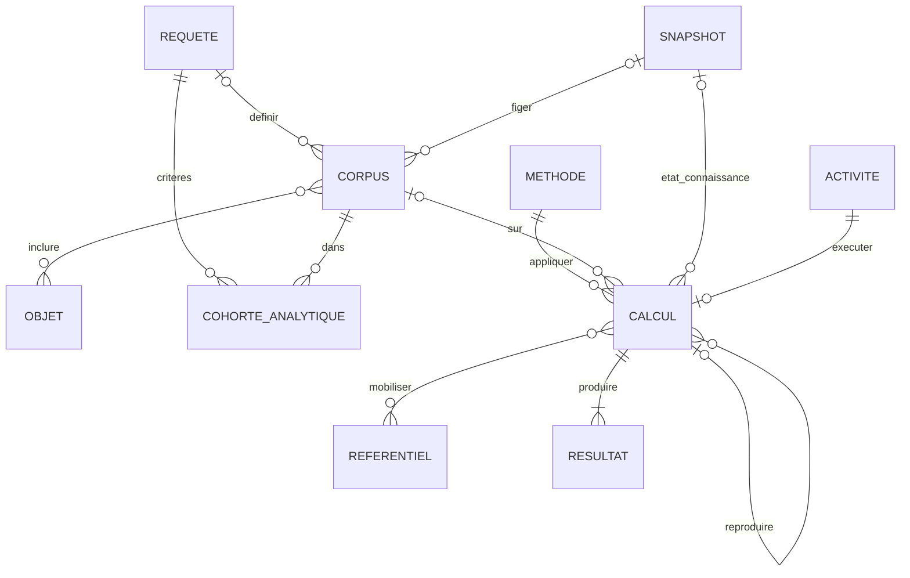

## 17.2 Entités

| Entité | Obj. | Définition | Propriétés |
|---|---|---|---|
| REQUETE | ✓ | Requête sauvegardée, versionnée, partageable, citable ; peut devenir veille (§ 43, § 91). | definition, mode {strict, recherche, exploratoire}, partage |
| CORPUS | ✓ | Jeu de recherche : manuel, par critères, dynamique ou figé ; citable (§ 39). | type {manuel, par critères, dynamique, figé}, definition |
| COHORTE_ANALYTIQUE | ✓ | Groupe construit par un chercheur selon des critères ; jamais une catégorie historique (§ 13.2). | libelle, criteres_texte |
| METHODE | ✓ | Méthode versionnée : dérivation de date, conversion, statistique, reconstruction spatiale, proposition de candidats, cooccurrence, OCR/HTR… (§ 9.3, § 40). | nom, type ⟨D-47⟩, description, hypotheses, parametres, limites, algorithme, version_algorithme |
| CALCUL | ✓ | Exécution datée d'une méthode sur un corpus et un état de connaissance (§ 40). | date, nature_execution {calcul initial, reproduction, rerun, nouvelle analyse}, parametres_effectifs |
| RESULTAT | ✓ | Résultat d'un calcul : statistique, entourage, cooccurrences, zone plausible, intervalle, candidats (§ 38, § 41). | type {statistique calculée, entourage, cooccurrences, comparaison de trajectoires, zone plausible, intervalle dérivé, liste de candidats, autre}, contenu, mode {dynamique, figé}, fraicheur {à jour, potentiellement obsolète, recalcul en cours}, date_dernier_calcul, couverture |

## 17.3 Associations

| Association | Pattes | Propriétés portées |
|---|---|---|
| DEFINIR_CORPUS / FIGER_CORPUS | REQUETE (0,n) — CORPUS (0,1) ; SNAPSHOT (0,n) — CORPUS (0,1) | — |
| INCLURE | CORPUS (0,n) — OBJET (0,n) | decision {inclus, exclu}, motif, mode {manuel, critère} |
| CRITERES / DANS | REQUETE (0,n) — COHORTE_ANALYTIQUE (1,1) ; CORPUS (0,n) — COHORTE_ANALYTIQUE (1,1) | — |
| APPLIQUER_METHODE | METHODE (version) (0,n) — CALCUL (1,1) | — |
| SUR | CORPUS (version) (0,n) — CALCUL (0,1) | — |
| ETAT_CONNAISSANCE | SNAPSHOT (0,n) — CALCUL (0,1) (à défaut, date de référence) | — |
| MOBILISER | CALCUL (0,n) — REFERENTIEL (version) (0,n) | — |
| EXECUTER_CALCUL | ACTIVITE (0,1) — CALCUL (1,1) | — |
| PRODUIRE_RESULTAT | CALCUL (1,n) — RESULTAT (1,1) | — |
| REPRODUIRE_CALCUL | CALCUL d'origine (0,n) — CALCUL (0,1) | — |

## 17.4 Règles de gestion

- **RG-O01** — Tout `RESULTAT` est rattaché à un `CALCUL` qui désigne la version de méthode, la version de corpus, les référentiels et l'état de connaissance utilisés. « 146 décès dans le corpus » ≠ « 146 décès réels ». (§ 38, § 40, critère 13)
- **RG-O02** — `nature_execution = reproduction` exige mêmes versions de méthode, de corpus et d'état que le calcul d'origine ; sinon c'est un `rerun` ou une `nouvelle analyse`. (§ 40.1)
- **RG-O03** — Un `RESULTAT` `figé` n'est jamais recalculé ; un `RESULTAT` `dynamique` passe à `potentiellement obsolète` quand une dépendance change, sans recalcul immédiat obligatoire. (§ 41, critère 41)
- **RG-O04** — Une statistique écrite dans une source est une `ASSERTION` ; une estimation du chercheur est une `INTERPRETATION` de type `estimation` ; seule une statistique calculée est un `RESULTAT`. (§ 38)
- **RG-O05** — Une `COHORTE_ANALYTIQUE` ne peut jamais être convertie en `COLLECTIF_HISTORIQUE`. (§ 13.2, critère 28)
- **RG-O06** — Les opérations déterministes (filtrer, compter, joindre, comparer des dates) sont modélisées comme `METHODE` de type déterministe ; une méthode IA générative n'est jamais requise pour produire un résultat essentiel. (§ 41, § 93)

---

# 18. Domaine P — Publication, pérennité, interopérabilité

## 18.1 Diagramme

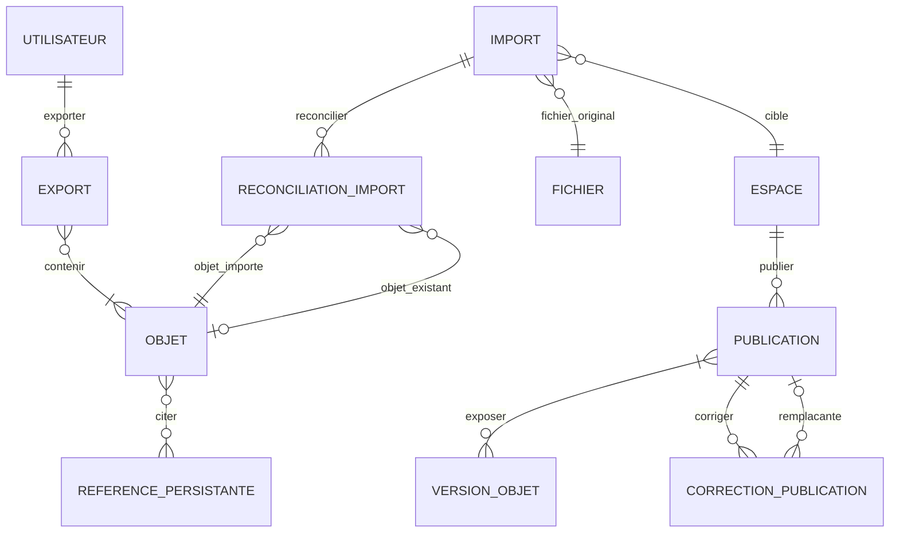

## 18.2 Entités

| Entité | Obj. | Définition | Propriétés |
|---|---|---|---|
| PUBLICATION | ✓ | Publication volontaire, sélective, versionnée : fiche, chronologie, carte, corpus, conclusion, article, édition critique (§ 76). | titre, type {fiche entité, chronologie, carte, corpus, conclusion, article, édition critique, page publique}, etat {brouillon, publiée, corrigée, remplacée, retirée}, date_publication, numero_edition, indexable |
| CORRECTION_PUBLICATION | ✓ | Correction historisée d'une publication (§ 77). | type {correction éditoriale mineure, erratum/corrigendum, nouvelle édition, retrait motivé}, motif, date |
| EXPORT | ✓ | Export de portabilité ou package de reproductibilité (§ 82, Q198). | format ⟨D-48⟩, version_format, perimetre, date, droits_appliques |
| IMPORT | ✓ | Import externe, réimport du format patrimonial ou restauration : l'import est une provenance (§ 83, § 84). | type {import externe, réimport patrimonial, restauration}, logiciel, format, version_format, fournisseur, date, avertissements |
| RECONCILIATION_IMPORT | ✓ | Issue de la réconciliation d'un objet importé avec l'existant (§ 83). | issue {nouveau, identique - reconnecté, local modifié - à comparer, Core évolué - lien proposé, incompatible - isolé} |

## 18.3 Associations

| Association | Pattes | Propriétés portées |
|---|---|---|
| PUBLIER | ESPACE (0,n) — PUBLICATION (1,1) | — |
| EXPOSER | PUBLICATION (1,n) — VERSION_OBJET (0,n) | mode_exposition {intégral, provenance masquée, pseudonymisé, existence seulement} |
| CORRIGER | PUBLICATION (0,n) — CORRECTION_PUBLICATION (1,1) ; CORRECTION_PUBLICATION (0,1) — PUBLICATION remplaçante (0,1) | — |
| CITER | OBJET citant (0,n) — REFERENCE_PERSISTANTE (0,n) | type {cite, s'appuie sur, discute, réfute, réutilise} |
| EXPORTER / CONTENIR_EXPORT | UTILISATEUR (0,n) — EXPORT (1,1) ; EXPORT (1,n) — OBJET (0,n) | — |
| FICHIER_ORIGINAL / CIBLE_IMPORT | IMPORT (1,1) — FICHIER (0,n) ; IMPORT (1,1) — ESPACE (0,n) | — |
| RECONCILIER | IMPORT (0,n) — RECONCILIATION_IMPORT (1,1) ; RECONCILIATION_IMPORT (1,1) — OBJET importé (0,n) ; RECONCILIATION_IMPORT (0,1) — OBJET existant (0,n) | — |

## 18.4 Règles de gestion

- **RG-P01** — Une publication expose des **versions** figées ; une évolution ultérieure de l'objet ne modifie pas la publication. La publication 2028 « 47 personnes » reste 47. (§ 40, § 77, CU-18)
- **RG-P02** — Avant de passer à `publiée`, chaque version exposée est vérifiée contre : embargos, personnes vivantes et mineurs, consentements, licences par composant, masquages. Une version sous embargo n'est exposable qu'en `existence seulement` ou `provenance masquée`, et seulement si la conclusion ne révèle pas le contenu protégé. (§ 37, § 60, § 73, CU-19)
- **RG-P03** — Une publication corrigée n'est jamais réécrite : la correction est un objet, la nouvelle édition une nouvelle `PUBLICATION`. (§ 77, critère 47)
- **RG-P04** — `public` ≠ `indexable` ≠ `réutilisable` : trois propriétés indépendantes. (§ 61.2, § 78)
- **RG-P05** — Le format patrimonial exporte identifiants, versions, assertions, hypothèses, dépendances, provenance, droits et embargos ; un embargo survit à l'export. (§ 82, § 88)
- **RG-P06** — Une restauration ne recrée que des objets de l'espace privé ; aucune `RECONCILIATION_IMPORT` ne publie dans le Core partagé. (§ 83, critère 46)
- **RG-P07** — Une API expose `DATE_HIST`, statut épistémique et provenance ; elle n'aplatit jamais une date hypothétique en date exacte. (§ 79, critère 44)

## 18.5 Consolidation canonique — import, export et confidentialité structurelle

### Import

Un import produit des `ACQUISITION_INFORMATION` et des objets/énoncés importés ; il ne transforme jamais les énoncés importés en vérités du Core.

Un réimport doit pouvoir reconnaître :

- le lot antérieur ;
- les identifiants externes ;
- l'empreinte du fichier ;
- les objets déjà acquis ;
- les divergences apparues depuis.

### Paquet patrimonial

Un export patrimonial possède un manifeste décrivant :

- version du schéma ;
- objets et versions ;
- relations ;
- fichiers et empreintes ;
- dépendances exportables ;
- identifiants persistants ;
- dépendances externes référencées.

Une restauration produit un rapport de restauration/reconnexion.

### Confidentialité

Le manifeste, les compteurs, les références et les dépendances d'un export sont eux-mêmes soumis au `CONTEXTE_EVALUATION`.

L'absence apparente d'un objet dans une API ne doit pas révéler qu'un objet caché existe.

---

# 19. Domaine Q — Organisation personnelle, veille, notifications

## 19.1 Diagramme

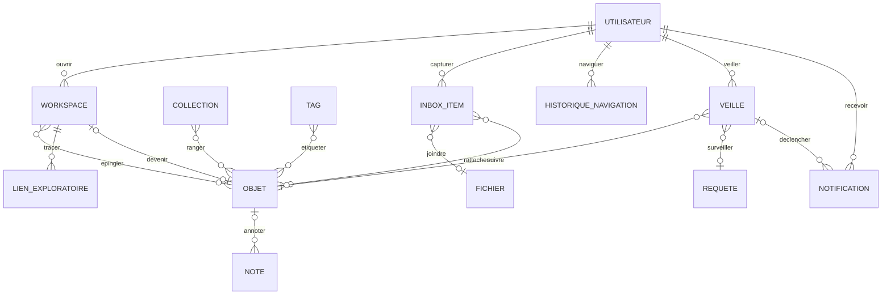

## 19.2 Entités

| Entité | Obj. | Définition | Propriétés |
|---|---|---|---|
| WORKSPACE | ✓ | Table de travail privée et temporaire : épingler, grouper, tracer des liens exploratoires sans toucher au Core (§ 47). | titre, etat {actif, converti, archivé, supprimé} |
| LIEN_EXPLORATOIRE | ✓ | Trait tracé entre deux objets sur une table de travail ; jamais une assertion. | libelle, objet_a (→ OBJET), objet_b (→ OBJET) |
| COLLECTION | ✓ | Organisation légère et transversale (§ 48.1). | titre, collaborative |
| TAG | ✓ | Étiquette libre, personnelle ou collaborative ; distincte d'un concept (§ 48.2). | libelle, portee {personnel, collaboratif} |
| INBOX_ITEM | ✓ | Capture brute : fichier, lien, note, photo, audio, vidéo, document reçu (§ 24.10, § 48.3). | type {fichier, lien, note, photo, audio, vidéo, document reçu}, contenu_brut, etat {capturé, qualifié, rattaché, traité, archivé}, date_capture |
| NOTE | ✓ | Note privée sur un objet. | texte |
| HISTORIQUE_NAVIGATION | — | Trace personnelle de navigation, purgeable, hors Core (§ 90). | `#id_navigation`, date, session |
| VEILLE | ✓ | Suivre un objet ou surveiller une condition (§ 91). | type {suivre, surveiller}, condition, mode_notification {immédiat, digest, in-app, silencieux}, active |
| NOTIFICATION | — | Notification explicable, hiérarchisée, groupable (§ 92). | `#id_notification`, date, motif ⟨D-49⟩, explication, priorite, groupe, lue |

## 19.3 Associations

| Association | Pattes | Propriétés portées |
|---|---|---|
| OUVRIR | UTILISATEUR (0,n) — WORKSPACE (1,1) | — |
| EPINGLER | WORKSPACE (0,n) — OBJET (0,n) | x, y, groupe, note |
| TRACER | WORKSPACE (0,n) — LIEN_EXPLORATOIRE (1,1) | — |
| DEVENIR | WORKSPACE (0,1) — OBJET (`PROJET`, `SNAPSHOT`, `ESPACE`) (0,1) | — |
| RANGER | COLLECTION (0,n) — OBJET (0,n) | rang |
| ETIQUETER | TAG (0,n) — OBJET (0,n) | — |
| CAPTURER / JOINDRE / RATTACHER | UTILISATEUR (0,n) — INBOX_ITEM (1,1) ; INBOX_ITEM (0,1) — FICHIER (0,n) ; INBOX_ITEM (0,n) — OBJET (0,n) | — |
| ANNOTER_NOTE | OBJET (0,n) — NOTE (0,1) | — |
| NAVIGUER | UTILISATEUR (0,n) — HISTORIQUE_NAVIGATION (1,1) ; HISTORIQUE_NAVIGATION (1,1) — OBJET (0,n) | — |
| VEILLER / SUIVRE / SURVEILLER | UTILISATEUR (0,n) — VEILLE (1,1) ; VEILLE (0,1) — OBJET (0,n) ; VEILLE (0,1) — REQUETE (0,n) | — |
| DECLENCHER / RECEVOIR | VEILLE (0,n) — NOTIFICATION (0,1) ; UTILISATEUR (0,n) — NOTIFICATION (1,1) ; NOTIFICATION (0,1) — OBJET (0,n) | — |

## 19.4 Règles de gestion

- **RG-Q01** — Aucune association de ce domaine ne produit d'`ASSERTION`, de `DEPENDANCE` probatoire ou de contribution : la position d'un objet sur une table n'est pas un fait historique. (§ 47, critère 42)
- **RG-Q02** — Un `INBOX_ITEM` n'exige aucune qualification ; aucun traitement IA lourd n'est déclenché à la capture. (§ 24.10, § 48.3, critère 43)
- **RG-Q03** — `HISTORIQUE_NAVIGATION` n'alimente jamais le Core et est purgeable par l'utilisateur. (§ 90)
- **RG-Q04** — Aucun `motif` de notification n'est relatif à l'engagement (« vous n'êtes pas venu depuis… »). (§ 92)

## 19.5 Consolidation canonique — graphe accessible, veille et notification

Pour toute opération susceptible de révéler la structure du graphe :

`GRAPHE_CONNU → filtrage par CONTEXTE_EVALUATION → GRAPHE_ACCESSIBLE → opération`

et non :

`GRAPHE_CONNU → opération → masquage du résultat`.

Sont concernées notamment :

- recherche ;
- traversée de graphe ;
- suggestion ;
- agrégation ;
- comptage ;
- calcul ;
- export ;
- notification.

Une notification n'est créée que si l'événement, son existence et le contenu nécessaire sont communicables au destinataire dans son contexte.

---

# 20. Domaine R — Référentiels et concepts

## 20.1 Diagramme

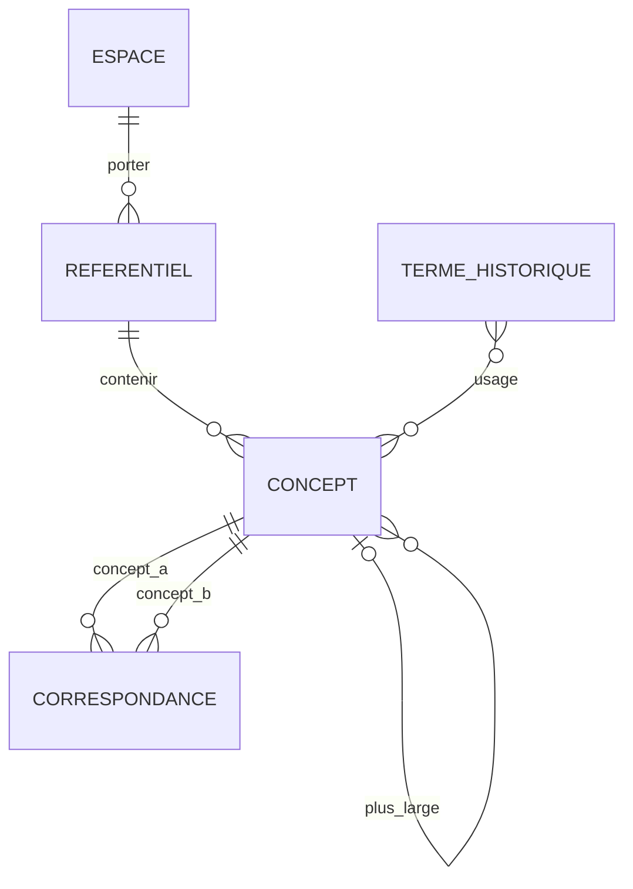

## 20.2 Entités

| Entité | Obj. | Définition | Propriétés |
|---|---|---|---|
| REFERENTIEL | ✓ | Vocabulaire versionné de niveau personnel / projet, communautaire ou commun GENIIUS (§ 31.3). | nom, niveau {personnel/projet, communautaire, commun GENIIUS}, description |
| CONCEPT | ✓ | Concept normalisé : prédicat, rôle, type d'entité, type documentaire, profession, statut juridique historique, nature d'événement… | libelle, definition, nature {prédicat, rôle, type d'entité, type documentaire, profession, statut, nature d'événement, autre}, statut_promotion {local, proposé au commun, promu, refusé} |
| TERME_HISTORIQUE | ✓ | Mot tel qu'employé dans les sources, dont le sens varie selon la période, le territoire et le corpus (§ 31.2). | forme, langue, ecriture |
| CORRESPONDANCE | ✓ | Correspondance entre concepts de cadres différents, sans imposer l'uniformité (§ 31.4). | type {équivalent, plus large, plus spécifique, proche, incompatible, contesté, inconnu} |

## 20.3 Associations

| Association | Pattes | Propriétés portées |
|---|---|---|
| PORTER | ESPACE (0,n) — REFERENTIEL (1,1) | — |
| CONTENIR_CONCEPT | REFERENTIEL (0,n) — CONCEPT (1,1) | — |
| PLUS_LARGE | CONCEPT parent (0,n) — CONCEPT (0,1) | — |
| CONCEPT_A / CONCEPT_B | CONCEPT (0,n) — CORRESPONDANCE (1,1) ×2 | — |
| USAGE | TERME_HISTORIQUE (0,n) — CONCEPT (0,n) | periode (`DATE_HIST`), territoire (→ `LIEU`), corpus (→ `CORPUS`), sens |

## 20.4 Règles de gestion

- **RG-R01** — La promotion d'un concept vers le référentiel commun est une décision humaine historisée, jamais un effet de popularité. (§ 31.3)
- **RG-R02** — Normaliser une assertion vers un concept ne modifie jamais son `libelle_source`. (§ 31.1)
- **RG-R03** — Deux cadres incompatibles coexistent ; une `CORRESPONDANCE` de type `incompatible` est une information, pas une erreur. (§ 31.4, Q237)

---

# 21. Types composés

Ce sont des **attributs structurés** (valeurs), pas des entités.

### DATE_HIST — date historique incertaine (§ 9.1, § 99, § 106.2)

| Composant | Description |
|---|---|
| expression_originale | Texte tel que saisi ou lu (« vers 1840 », « le 3 brumaire an II ») |
| type_date | {exacte, approximative, intervalle, avant, après, vers, calculée, déduite, estimée, inconnue} |
| calendrier | {grégorien, julien, républicain, autre} |
| borne_min, borne_max | Bornes normalisées (peuvent être vides) |
| precision | {jour, mois, année, décennie, siècle} |

Règle : « vers 1840 » n'est jamais stocké comme 01/01/1840 exact.

### VALEUR — valeur mesurée ou déclarée (§ 9.4)

| Composant | Description |
|---|---|
| valeur_originale | Telle que dans la source (« 30 ans », « 1 200 livres ») |
| valeur_normalisee | Optionnelle |
| unite_originale | Unité d'origine |
| monnaie_originale | Monnaie d'origine |
| type_valeur | {nombre, âge déclaré, montant, mesure, effectif, texte} |

### GEOM — géométrie

| Composant | Description |
|---|---|
| systeme | Système de coordonnées (géographique) ou repère image |
| forme | {point, ligne, polygone, multipolygone, zone floue} |
| coordonnees | Coordonnées |

---

# 22. Domaines de valeurs (énumérations)

Ces listes sont **initiales** : celles qui décrivent le monde historique devront à terme vivre dans des `REFERENTIEL` (P14). Les listes de gouvernance (statuts, cycles) restent fermées.

| Code | Domaine | Valeurs |
|---|---|---|
| D-01 | etat_cycle_vie | actif, archivé, corbeille, suppression demandée, supprimé, conservation légitime |
| D-02 | etat_examen | détecté automatiquement, préstructuré automatiquement, examiné, corrigé, validé humainement |
| D-03 | statut_validation | proposée, en vérification, validée, contestée, réexamen, confirmée, corrigée, indéterminée, rejetée |
| D-04 | visibilite | privé, projet, famille, cercle invité, communauté GENIIUS, public non indexé, public indexable |
| D-05 | decouvrabilite | non découvrable, recherche interne, indexable Web |
| D-06 | type_activite | création, saisie, transcription, annotation, extraction de mention, identification, rapprochement, assertion, calcul, validation, contestation, correction, import, export, contribution, publication, restauration, OCR/HTR, détection visuelle, transformation d'image, suppression |
| D-07 | type_dependance | appui probatoire, dérivation/calcul, localisation, citation, reconstruction, publication d'un état, droits |
| D-08 | role_probatoire | principal, complémentaire, marge, verso, page suivante, contexte, contradictoire |
| D-09 | type_espace | personnel, privé, familial, projet, organisation, communauté, Core partagé, publication publique |
| D-10 | action (permission) | voir, commenter, proposer, transcrire, valider, éditer, administrer, exporter, repartager, contribuer au Core |
| D-11 | role (garde) | dépositaire/custodien, administrateur, destinataire, successeur de gouvernance, successeur scientifique, dépositaire patrimonial |
| D-12 | nature (document) | acte manuscrit, registre, imprimé, photographie, enregistrement sonore, vidéo, témoignage, carte/plan, objet inscrit, page web, autre |
| D-13 | statut_existence | prescrit seulement, existence attestée, conservé et localisé, non localisé, perdu, disparu, détruit, présumé détruit, inaccessible, lacunaire |
| D-14 | etat_provenance | sourcée, source connue non localisée, provenance perdue à l'import, tradition orale, provenance à retrouver, non sourcée |
| D-15 | etat_acces | accessible, partiel, inaccessible, disparu, inconnu |
| D-16 | type (reproduction) | photographie, scan, microfilm, numérisation institutionnelle, photocopie, enregistrement, crop, restauration, colorisation, débruitage, generative fill, amélioration, transcodage |
| D-17 | role (responsabilité) | rédacteur, auteur intellectuel, signataire, informateur, déclarant, autorité émettrice, destinataire, collecteur, déposant, ancien détenteur, conservateur actuel, numériseur, diffuseur |
| D-18 | type_ordre | actuel observé, historique attesté, historique reconstruit |
| D-19 | plausibilité / certitude | forte, probable, possible, faible, écartée provisoirement, rejetée, indéterminée |
| D-20 | couche (transcription) | diplomatique, semi-diplomatique/lecture, normalisée, développée (expansions), translittération, traduction |
| D-21 | type (annotation) | signature, tampon, rature, changement d'encre, changement de main, dommage, marginalia, inscription, note de contexte, avertissement, appareil critique |
| D-22 | nature (mention) | nominale, descriptive, relationnelle, numérique, visuelle, vocale, signature, main d'écriture |
| D-23 | statut_resolution | non traitée, en attente, identifiée, candidats multiples, non individualisable, structure non résolue |
| D-24 | couche_spatiale | géographie physique, territoire historique, parcelle/propriété, division administrative/institutionnelle, occupation/usage du sol, bâti/logement, voie |
| D-25 | mode_realite | intention, demande, projet, décision, autorisation, refus, abandon, commencement, réalisation, interruption |
| D-26 | famille_relation | parenté, alliance, sociale, économique, juridique, organisationnelle, spatiale, causale, autre |
| D-27 | modele_parente | biologique, légal, social, déclaré, nourricier, élevé par, autre système |
| D-28 | referentiel_spatial | administratif, religieux, judiciaire, cadastral, électoral, militaire, postal, physique |
| D-29 | type_droit | propriété, usufruit, indivision, hypothèque, bail, concession, servitude |
| D-30 | modalite (assertion) | affirmée par la source, déclarée par un tiers dans la source, proposée par un chercheur, proposée automatiquement, issue d'une mémoire |
| D-31 | type_vide | non recherché, recherche partielle, recherche exhaustive sans résultat, non mentionné, explicitement absent, illisible, lacune matérielle, inconnu, non applicable, question non posée |
| D-32 | niveau (transmission) | existence de l'information, accessibilité, exposition possible, réception attestée, connaissance attestée, adhésion/croyance |
| D-33 | type (évaluation) | proposition, mise en vérification, validation, contestation, demande de réexamen, confirmation, correction, indétermination, rejet |
| D-34 | role_credit | auteur, coauteur, contributeur intellectuel, transcripteur, identificateur, vérificateur, photographe, logisticien, relecteur, proposant, remercié |
| D-35 | type (anomalie) | numéro manquant, pages absentes, années absentes, rupture de série, volume incomplet, document attendu absent, copie divergente |
| D-36 | etat_memoire | su et dit, jamais su, savait mais a oublié, souvenir partiel, incertain, refuse, à vérifier, non demandé, exclu volontairement |
| D-37 | mode_connaissance | vécu, vu directement, entendu d'un témoin, tradition familiale, déduction, souvenir incertain, inconnu |
| D-38 | etat_cycle (projet) | actif, en sommeil, bloqué, clôturé dans son périmètre, transmis, abandonné, archivé |
| D-39 | etat (question) | ouverte, en cours, suffisamment traitée selon protocole, résolue, à réexaminer, suspendue, abandonnée |
| D-40 | recherchabilite | pistes disponibles, pistes potentielles, bloquée actuellement, aucune piste connue, insolubilité fortement documentée |
| D-41 | niveau_consultation | repéré au catalogue, commandé, communiqué, consultation partielle, consultation exhaustive, reproduction, exploitation |
| D-42 | statut (item de mission) | à commander, commandé, communiqué, consulté, refusé, absent, photographié, incomplet, à refaire |
| D-43 | portee (règle) | occurrence, préférence personnelle, main/scribe, registre, corpus, territoire, période |
| D-44 | portee_nouveaute | nouveau pour l'utilisateur, nouveau pour le projet, nouveau dans GENIIUS, nouvelle preuve d'un fait connu, évolution réelle |
| D-45 | type (flux) | contribution privé→Core, import Core→privé, comparaison Tree↔Tree, échange Tree↔Tree, restauration |
| D-46 | type_localisation | exacte, approximative, relative, zone possible, hypothèse concurrente |
| D-47 | type (méthode) | dérivation de date, conversion monétaire, conversion de mesure, statistique, reconstruction spatiale, proposition de candidats, cooccurrence, entourage, comparaison de trajectoires, datation croisée, OCR/HTR, détection visuelle, regroupement vocal, autre |
| D-48 | format (export) | format patrimonial GENIIUS, GEDCOM, CSV, JSON, GeoJSON, bibliographique, médias originaux, package de reproductibilité |
| D-49 | motif (notification) | nouvelle source liée, identification contestée, dépendance modifiée, divergence de filiation, source devenue accessible, preuve devenue inaccessible, élément pertinent pour une question, demande reçue, capsule délivrable |

---

# 23. Traçabilité

## 23.1 Cas d'usage → structures

| CU | Cas | Structures qui le portent |
|---|---|---|
| CU-01 | Charles TANCRÈDE 1881–1890 | `EVENEMENT` (`mode_realite` décision vs réalisation) ; `RECIT` judiciaire ; `PRESENCE` sans trajet ; `QUESTION` + `RECHERCHE_EFFECTUEE` négatives 1884–1888 ; `INTERPRETATION` (conclusion) versionnée ; `DEPENDANCE` |
| CU-02 | Habitation Dolé 1793 | `APPLICATION_PROTOCOLE` sur le document ; `PERSONNE` à individualisation minimale ; `COLLECTIF_HISTORIQUE` ; `CANDIDATURE` 1793→1802 ; `densite_documentaire` jamais utilisée comme poids |
| CU-03 | Registre perdu de Deshaies | `DOCUMENT` (statut perdu) ; `RECONSTRUCTION` concurrentes ; `ELEMENT_RECONSTRUIT` ; `APPUYER` ; `CANDIDATURE` rejetée conservée ; `REFERENCE_PERSISTANTE` figée |
| CU-04 | Projet CHARBONNÉ | `ARBRE` privé ; `OPERATION_FLUX` ; `FILIATION` ; `SNAPSHOT` ; `DECOUVERTE` ; `DESIGNATION_GARDE` ; `EXPORT` patrimonial |
| CU-05 | Photo familiale | `PAGE` recto/verso ; `EMPLACEMENT` d'album ; `ANNOTATION` (inscriptions) ; `REGROUPEMENT_TRACES` visuel ; propositions concurrentes ; `regime_protection` ; `CONSENTEMENT` biométrie |
| CU-06 | Mémoire familiale | `SESSION_MEMOIRE` (auto / tiers) ; `ECHANGE` ; `REPONSE` (oubli, révision) ; `EMBARGO` ; `CAPSULE` ; `CAMPAGNE_MEMOIRE` ; `DESIGNATION_GARDE` |
| CU-07 | Mission aux archives | `MISSION` ; `ITEM_MISSION` ; `INTERVENIR` (délégation) ; `MICRO_MISSION` ; `niveau_consultation` ; `REPRODUCTION` ; `RECHERCHE_EFFECTUEE` négative |
| CU-08 | Reconstruction territoriale | `LIEU` multi-couches ; `RELATION` spatiales ; `SITUATION` (droit sur bien, hypothèque) ; `EVENEMENT` de mutation ; `GEOMETRIE` incertaine |
| CU-09 | Statistique historique | `CORPUS` ; `METHODE` ; `CALCUL` ; `RESULTAT` dynamique / figé / obsolète ; `DIFF_CONNAISSANCE` |
| CU-10 | Désaccord scientifique | `ACTE_EVALUATION` ; `GROUPE` / `LIEN_INTERET` (indépendance) ; `ARGUMENT` ; réexamen ; `CREDIT` |
| CU-11 | Publication à droits mixtes | `LICENCE` par composant ; `EMBARGO` ; `MASQUAGE` ; `EXPOSER.mode_exposition` ; `indexable` |
| CU-12 | Pérennité | `EXPORT` / `IMPORT` ; `RECONCILIATION_IMPORT` ; `FILIATION` ; `DESIGNATION_GARDE` |
| CU-13 | « Un des fils de Jean DUPONT » | `POSITION_RELATIONNELLE` + `CANDIDATURE` + `ARGUMENT` |
| CU-14 | CHARBONNET / CHARBONNIER | Deux `ASSERTION_ATTRIBUT` de nom, chacune ancrée ; `CHOIX_AFFICHAGE` ; RG-D03 |
| CU-15 | Emploi 1834 / 1837 / 1841 | Trois `SITUATION` à `continuite = points attestés seulement` ; continuité éventuelle séparée (RG-G05) |
| CU-16 | Photo « Joseph / Paul » | Deux `ANNOTATION` + deux `ASSERTION` concurrentes + `REPONSE` Journal |
| CU-17 | Convoi de 24 personnes | `COLLECTIF_HISTORIQUE` (effectif 24) + 1 `PERSONNE` + 23 `POSITION_RELATIONNELLE` au plus, jamais 23 personnes |
| CU-18 | « 47 personnes à Dolé » | `RAPPROCHEMENT` scindé → `DEPENDANCE` → `RESULTAT` dynamique 48 ; `PUBLICATION` 2028 expose la version 47 ; `DIFF_CONNAISSANCE` |
| CU-19 | Témoignage sous embargo | `EMBARGO` + RG-P02 + `mode_exposition = provenance masquée` |
| CU-20 | Validation 2028, preuve disparue 2035 | `ACTE_EVALUATION` conservé ; `etat_acces = disparu` ; `TACHE` d'origine `preuve inaccessible` |
| CU-21 | Arsène CHARBONNÉ dans deux Trees | Deux `ESPACE`, deux `PERSONNE`, deux `RAPPROCHEMENT` vers la même entité Core ; aucun lien entre utilisateurs |
| CU-22 | Personne sans nom | `REQUETE` par contraintes → `RESULTAT` (liste de candidats) ; aucune `PERSONNE` créée pour le profil |
| CU-23 | Première / dernière attestation | Calcul sur `ASSERTION` (RG-G11) |
| CU-24 | Autorisation de voyage | `EVENEMENT` `mode_realite = autorisation` ; aucun `VOYAGE` réalisé |
| CU-25 | Acte manquant | `ANOMALIE_DOCUMENTAIRE` + `INTERPRETATION` (hypothèses) + `PISTE` |

## 23.2 Critères de recette (CDCF § 103) → mécanisme

| # | Mécanisme principal |
|---|---|
| 1 | `etat_examen`, `statut_validation`, `ASSERTION.nature` / `modalite` / `plausibilite` |
| 2 | RG-D01 ; `VERSION_OBJET` |
| 3 | RG-D03 |
| 4 | RG-F04 |
| 5–7 | RG-E02 |
| 8 | RG-B01 |
| 9 | RG-L02 |
| 10 | RG-L03 |
| 11 | RG-P02 |
| 12 | RG-N01 |
| 13 | RG-O01 |
| 14 | RG-A06 ; `etat_examen` |
| 15 | RG-A05 |
| 16 | RG-H04 |
| 17 | RG-C03 ; RG-H02 ; `CITATION_DOCUMENTAIRE` ; `TRANSMISSION` |
| 18 | RG-Q02 |
| 19 | RG-K01 ; `RECHERCHE_EFFECTUEE.couverture` |
| 20 | RG-K03 |
| 21 | RG-K04 |
| 22 | RG-E06 |
| 23 | P7 ; § 14 (Tree dans un espace privé) |
| 24 | RG-A03 |
| 25 | RG-A04 ; `DEPENDANCE.type = droits` ; § 97 |
| 26 | RG-D04 |
| 27 | RG-E03 ; RG-R02 |
| 28 | RG-O05 |
| 29–30 | RG-G06 |
| 31–32 | RG-E05 |
| 33 | RG-C05 |
| 34 | RG-C06 |
| 35 | RG-H06 ; `BADGE` jamais cible de `ETAYER` |
| 36 | RG-H03 |
| 37 | RG-B04 ; RG-J07 |
| 38 | RG-D04 ; `SIGNALER_CONTEXTE` |
| 39 | `FINANCEMENT` sans effet sur `ACTE_EVALUATION` |
| 40 | `UTILISATEUR.identite_civile` interne + `mode_affichage_public` |
| 41 | RG-O03 |
| 42 | RG-Q01 |
| 43 | RG-Q02 |
| 44 | RG-P07 |
| 45 | RG-P05 |
| 46 | RG-P06 |
| 47 | RG-P03 |
| 48 | P4 ; `VERSION_OBJET.date_debut_validite` / `date_fin_validite` ; `SNAPSHOT` |
| 49 | RG-E02 ; `densite_documentaire` non pondérante |
| 50 | `LACUNE` ; `plausibilite = indéterminée` ; `POSITION` ouverte |

---

# 24. Mise à l'épreuve du modèle sur quatre cas

Le CDCF exige que le MCD soit testé sur les cas d'usage avant validation (Partie XVIII). Voici quatre déroulés en occurrences.

## 24.1 « Charles TANCRÈDE, âgé de 30 ans » (§ 4, § 9.2)

1. `DOCUMENT` (arrêt de 1882) → `EXEMPLAIRE` (minute) → `REPRODUCTION` (photo 2027) → `VUE` 12 → `ZONE` z1.
2. `TRANSCRIPTION` (couche lecture) → `SEGMENT` s1 « Charles TANCRÈDE, âgé de 30 ans », aligné sur z1.
3. `MENTION` m1 « Charles TANCRÈDE » localisée sur s1/z1.
4. `PROPOSITION_IDENTIFICATION` m1 → `PERSONNE` P-1, plausibilité `probable`, deux `ARGUMENT` pour.
5. `ASSERTION` a1 : sujet P-1, prédicat « âge déclaré », valeur `{30 ans}`, temps = date de l'acte, `nature = attestée`, `ANCRER` z1, `FONDER` m1.
6. `CALCUL` c1 (méthode « âge déclaré → intervalle de naissance » v1) → `ASSERTION` a2 : sujet P-1, prédicat « naissance », `DATE_HIST` {type calculée, 1851–1852}, `nature = dérivée`, `DEPENDANCE` a2 → a1.
7. Relecture : « 36 ans ». Nouvelle `VERSION_OBJET` de s1 et de a1 ; RG-A04 passe `DEPENDANCE` a2→a1 à `potentiellement affecté` ; a2 n'est pas modifiée ; la conclusion biographique qui s'appuie sur a2 passe à `à réexaminer` ; la version précédente de la biographie reste consultable.

**Vérifié :** on sait ce que dit la source, quel calcul a été fait, selon quelle méthode, sur quelles hypothèses (§ 4, critère de vérification).

## 24.2 « L'un des fils de Jean DUPONT » (§ 5 cas B, CU-13)

1. `MENTION` m2 « l'un des fils de Jean DUPONT », `statut_resolution = structure non résolue`.
2. `POSITION_RELATIONNELLE` pos1 : référence `PERSONNE` Jean, relation type `CONCEPT` « fils », nature `un parmi des candidats`.
3. `PROPOSITION_IDENTIFICATION` m2 → pos1.
4. Trois `CANDIDATURE` pos1 ← Pierre / Louis / François, chacune avec ses `ARGUMENT`.
5. Aucune `PERSONNE` « Inconnu DUPONT ».

## 24.3 Registre perdu, entrée n°8 (§ 20.4, CU-03, CU-18)

1. `DOCUMENT` R (`statut_existence = perdu`) ; `ASSERTION` `EXISTENCE_DOCUMENTAIRE` ancrée sur trois mariages.
2. `RECONSTRUCTION` rec1 → `ELEMENT_RECONSTRUIT` e8 (entrée, numéro 8, `statut_contenu = reconstruit`), `APPUYER` e8 ← mentions « inscrite au registre sous le n°8 ».
3. `CANDIDATURE` e8 ← Rose CARMEN, `probable`.
4. Le `RESULTAT` dynamique « 47 personnes » (`CALCUL` sur corpus Dolé) dépend de e8 ; la `PUBLICATION` 2028 expose sa version « 47 ».
5. Nouvelle source : le n°8 désigne une autre personne. `ACTE_EVALUATION` `rejet` sur la candidature Rose (conservée, `statut = rejetée`) ; nouvelle `CANDIDATURE` ; `RESULTAT` dynamique → `potentiellement obsolète` → recalcul « 48 » ; la publication 2028 reste « 47 » ; `DIFF_CONNAISSANCE` explique le passage, déclenché par la `DECOUVERTE`.

## 24.4 Arsène CHARBONNÉ dans deux Trees (§ 26.2, CU-21)

1. Espace A (privé) : `ARBRE` tA, `NOEUD_ARBRE` → `PERSONNE` pA. Espace B (privé) : `ARBRE` tB, `NOEUD_ARBRE` → `PERSONNE` pB.
2. Core partagé : `PERSONNE` pC.
3. `RAPPROCHEMENT` pA ↔ pC (portée `privé→Core partagé`) créé par A ; `RAPPROCHEMENT` pB ↔ pC créé par B.
4. Aucune association ne relie A et B ; les assertions de pA restent dans l'espace A. Si A contribue une assertion sur pA : `OPERATION_FLUX` (contribution) → nouvelle `ASSERTION` sur pC dans le Core partagé + `FILIATION` vers la version d'origine ; aucune synchronisation ultérieure.

---

# 25. Choix de modélisation à valider et sujets laissés au MLD

## 25.1 Choix conceptuels proposés, à confirmer

| # | Choix | Alternative écartée | Pourquoi ce choix |
|---|---|---|---|
| C1 | Super-type `OBJET` unique pour tout objet de connaissance ou de travail | Mécanismes de version, droits, dépendances dupliqués par entité | Les exigences de version, droits, dépendance et citation sont universelles dans le CDCF. |
| C2 | Les faits sont tous des `ASSERTION` (profils typés) | Tables d'attributs par type d'entité | Seule manière de conserver multiplicité, temporalité, provenance et contradiction (Partie XVIII). |
| C3 | `QUESTION` commune à Journal et Echo (`portee` mémoire / recherche) | Deux entités distinctes | « Qui était Ti-René ? » passe de Journal à Rebond à Echo sans copie (CU-06, § 24.12). |
| C4 | `ELEMENT_RECONSTRUIT` ⊂ `POSITION` | Mécanisme de candidature spécifique aux reconstructions | Une entrée de registre perdu et « l'un des fils » sont la même chose : une place humaine sans individu déterminé. |
| C5 | Un `ARBRE` est une vue sur des `PERSONNE` et `RELATION` de son espace | Modèle Tree léger séparé (fiches individus avec champs) | Permet à Tree d'utiliser tout le modèle sans contribuer (§ 4.1) ; évite une synchronisation interne Tree ↔ Core privé. À valider avec l'UX de saisie rapide. |
| C6 | Le lien Tree → Core est un `RAPPROCHEMENT` | Lien technique dédié | C'est une hypothèse d'identité, qui doit pouvoir être contestée et argumentée (§ 8.1). |
| C7 | La mémoire produit un `DOCUMENT` | Témoignages hors chaîne documentaire | « La mémoire personnelle est une source » (§ 18) : mêmes zones, transcriptions, mentions, ancrages. |
| C8 | `EVENEMENT` est une entité ; `SITUATION` est une assertion | Les deux en entités | Un événement a une identité (récits concurrents, participants) ; une situation est un état daté d'une relation. |
| C9 | Le statut de validation est dérivé des `ACTE_EVALUATION` | Champ éditable | Garantit l'historique du débat (§ 50, § 75). |
| C10 | `CONTACT` (Echo) distinct de `PERSONNE` / `ORGANISATION` mais peut les représenter | Contact = entité historique | Un carnet d'adresses privé n'est pas de la connaissance historique (§ 57, P12). |

## 25.2 Laissé au modèle logique / physique (CDCF § 116)

- Stratégie de persistance des versions (event sourcing, tables d'historique, stockage bitemporel) et de `etat_fige`.
- Implémentation de l'héritage (table unique, tables par sous-type, graphe de propriétés).
- Stockage des assertions (relationnel typé, graphe, triplets) et index pour la recherche par contraintes (CU-22).
- Propagation des `DEPENDANCE` (synchrone, file de traitement) et calcul de la vérifiabilité relative aux droits (§ 74).
- Évaluation des `REGLE_ACCES` (ACL, politiques, cache) et isolation des espaces (§ 95).
- Schéma des identifiants persistants (ARK, URI internes).
- Types géométriques et projections ; formats d'image et de média (IIIF ou autre).
- Spécification du format patrimonial GENIIUS (sérialisation de ce MCD).

## 25.3 Points ouverts à arbitrer

1. **Granularité des versions** : versionner chaque `SEGMENT` ou la `TRANSCRIPTION` entière ? Le MCD autorise les deux ; les citations de ligne (§ 87) plaident pour le segment.
2. **Normalisation des prédicats** : quels prédicats du référentiel commun sont livrés au lancement (nom, âge déclaré, naissance, décès, mariage, profession, résidence, statut juridique, présence, parenté…) ?
3. **Seuil d'individualisation** : le CDCF refuse un seuil universel (§ 6.2). Faut-il au moins exiger un `ARGUMENT` lors de la création d'une `PERSONNE` sur le Core partagé (§ 106.4, « plus le statut monte, plus la rigueur augmente ») ?
4. **Indépendance des sources** : calculée à la volée à partir de `CITATION_DOCUMENTAIRE`, lignées de reproduction et `TRANSMISSION`, ou matérialisée ? (§ 112)
5. **Connect** : périmètre exact des jeux et quiz, à préciser par l'architecture fonctionnelle de l'application (CDCF § 115, phase 2).

---

# 26. Consolidation V1.1 — matrice de reprise des crash-tests

| Apport crash-testé | Intégration canonique |
|---|---|
| Identité locale / partagée | ESPACE + REFERENCE_INTER_ESPACE + RAPPROCHEMENT |
| Référence ≠ filiation ≠ correspondance | Domaines A et F |
| État d'une référence externe | ETAT_REFERENCE_EXTERNE |
| Compte ≠ acteur ≠ personne | COMPTE + ACTEUR_GENIIUS + liens dédiés |
| Production ≠ justification | DEPENDANCE_PRODUCTION + DEPENDANCE_JUSTIFICATION + BASE_JUSTIFICATIVE |
| Acquisition ≠ preuve | ACQUISITION_INFORMATION / DOCUMENTAIRE |
| Droits sur les arêtes | REGLE_ACCES applicable aux unités gouvernées et associations réifiées |
| Confidentialité de l'existence | portée des règles + CONTEXTE_EVALUATION |
| Applicabilité d'un droit dérivé | DECISION_APPLICABILITE_DROIT |
| Diffusabilité contextuelle | EVALUATION_DIFFUSABILITE |
| Graphe visible avant calcul | RG-Q canonique |
| Circularité du raisonnement | DEPENDANCE_RAISONNEMENT |
| Traduction ≠ nouvelle vérité | EXPRESSION_ASSERTION / dérivation |
| Ressource binaire ≠ document | FICHIER distinct de REPRODUCTION/DOCUMENT |
| Import / réimport | IMPORT + ACQUISITION + RECONCILIATION_IMPORT |
| Export patrimonial | EXPORT + manifeste + rapport de restauration |
| Sélection pratique ≠ vérité | SELECTION_CONTEXTE / CHOIX_AFFICHAGE |
| Positions scientifiques concurrentes | POSITION_EPISTEMIQUE |

---

# 27. Tests de non-régression canoniques

Le V1.1 doit continuer à réussir au minimum les scénarios suivants :

1. cinquante projets référencent la même identité Core sans la copier ;
2. un projet dérive volontairement un état local divergent ;
3. deux identités locales sont rapprochées sans fusion irréversible ;
4. une relation privée relie deux personnes publiques sans fuite ;
5. une preuve privée conduit historiquement à une conclusion désormais justifiée publiquement ;
6. un compte est supprimé sans perdre l'attribution scientifique légitime ;
7. un GEDCOM est importé deux fois sans devenir deux ensembles de preuves ;
8. une cible Core est scindée sans réécrire silencieusement Tree ;
9. un agrégat public ne révèle pas le nombre d'éléments secrets ;
10. une notification ne révèle pas l'existence d'une contradiction privée ;
11. une exportation ne révèle pas une dépendance interdite ;
12. une traduction n'écrase pas la proposition originale ;
13. un fichier identique dans deux contextes ne fusionne pas deux documents ;
14. un raisonnement circulaire n'est pas compté comme corroboration indépendante ;
15. deux positions scientifiques incompatibles coexistent ;
16. une source importée mais non identifiée reste `SOURCE_EXTERNE_DECLAREE` ;
17. une nouvelle numérisation exige un nouvel alignement des zones ;
18. une révocation de consentement ne détruit pas mécaniquement une conclusion indépendamment justifiée ;
19. un Tree conserve sa souveraineté après évolution du Core ;
20. l'API ne distingue pas « rien n'existe » de « quelque chose existe mais vous ne pouvez pas connaître son existence » lorsque la politique l'interdit.

---

# 28. Statut de gel

Le présent document est la **référence MCD canonique de GENIIUS**.

Il remplace les deux branches antérieures. Le prochain artefact de conception est le **Dictionnaire de données GENIIUS**, qui devra transformer les objets conceptuels en définitions exhaustives et décider notamment :

- table physique ou abstraction ;
- identifiants et namespaces ;
- attributs obligatoires/facultatifs ;
- cardinalités logiques finales ;
- contraintes d'intégrité ;
- stratégies de versionnement ;
- traduction des droits contextuels ;
- règles de suppression et rétention ;
- indexation ;
- matérialisation éventuelle de graphes et agrégats.

Une difficulté SQL, Supabase, API, RLS, performance ou UX ne justifie pas à elle seule de rouvrir le MCD.
